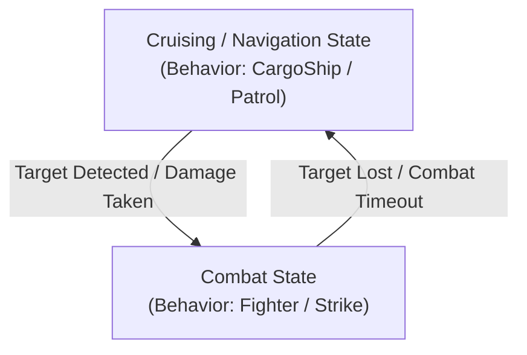

# AI Behaviors, Autopilot & Combat Systems

Architectural guide to RivalAI behavior trees, the 11 behavior subclasses, Enenra's Role vs. CombatType state machine, autopilot configurations, and squad command networks.

---

## 1. AI Behavior Subclasses

Every RivalAI behavior profile (`[RivalAI Behavior]`) assigns a `[BehaviorName:<Subclass>]` that dictates the grid's core flight and engagement model:

| Subclass | Flight & Combat Logic | Primary Environment | Default Fallback Autopilot Profile |
| :--- | :--- | :--- | :--- |
| **`Passive`** | Stationary or drift; non-navigating. Used for stations, derelicts, and static stores. | All | `RAI-Generic-Autopilot-Passive` |
| **`CargoShip`** | Flies straight between initial spawn and destination despawn waypoint. | Space / Planet | `RAI-Generic-Autopilot-CargoShip` |
| **`Escort`** | Formations with designated leader grid (`LeaderType:Owner/Faction`); breaks formation when engaging. | Space / Planet | `RAI-Generic-Autopilot-Escort` |
| **`Fighter`** | High-speed interceptor; performs strafing runs, breakaway loops, and evasive rolls. | Space / Planet | `RAI-Generic-Autopilot-Fighter` |
| **`FighterPlane`** | Atmospheric attack plane; continuous diving runs, fixed weapons, forward-velocity climbing breakaway. | Planet | `RAI-Generic-Autopilot-Strike` |
| **`HorseFighter`**| Hybrid standoff fighter; orbits target at weapon range, making rapid firing passes. | Space / Planet | `RAI-Generic-Autopilot-HorseFighter` |
| **`Horsefly`** | Standoff skirmisher; maintains distance, orbits target, and fires turreted weaponry. | Space / Planet | `RAI-Generic-Autopilot-Horsefly` |
| **`HorseNautical`**| Hybrid naval vessel; standoff aquatic skirmisher adhering to water line. | Planet (Water Mod) | `RAI-Generic-Autopilot-Horsefly` |
| **`Hunter`** | Relentless tracker; seeks out high-threat player grids across long distances. | Space / Planet | `RAI-Generic-Autopilot-Hunter` |
| **`Nautical`** | Water Mod naval vessel; adheres to buoyancy surface lines and aquatic pathing. | Planet (Water Mod) | `RAI-Generic-Autopilot-Nautical` |
| **`NauticalRoutes`**| Water Mod vessel following predefined aquatic shipping routes. | Planet (Water Mod) | `RAI-Generic-Autopilot-Nautical` |
| **`Patrol`** | Loops through a series of patrol waypoints; breaks off to engage on threat. | Space / Planet | `RAI-Generic-Autopilot-Patrol` |
| **`Scout`** | Reconnaissance craft; patrols waypoints, performs radar scans, calls reinforcements. | Space / Planet | `RAI-Generic-Autopilot-Scout` |
| **`Sniper`** | Extreme long-range artillery; maintains 2km–5km standoff distance with fixed weapons. | Space / Planet | `RAI-Generic-Autopilot-Sniper` |
| **`Strike`** | Heavy attack craft; approaches high, initiates high-speed diving run, breaks off. | Space / Planet | `RAI-Generic-Autopilot-Strike` |

> [!TIP]
> **Autopilot Fallback**: If an encounter does not define `[AutopilotData:<SubtypeId>]`, MES automatically falls back to `RAI-Generic-Autopilot-<BehaviorName>` (or `RAI-Generic-Autopilot-Strike` for `FighterPlane`). Defining custom autopilot profiles is always recommended for fine-tuned combat performance.

---

## 2. Dynamic Behavior Subclass & Autopilot State Switching

MES natively allows an NPC grid to transition between passive navigation and combat states using action tags. Modders can construct state machines using native RivalAI tags:



> [!NOTE]
> Some community mods (such as `mes-shared-behaviors`) use custom strings (`[CustomStrings:Role,...]` / `[CustomStrings:CombatType,...]`) as arbitrary variable names to track states. These are user-defined string conventions, **not** native MES tags. The actual engine mechanisms doing the work are the native tags below.

### State Switching Implementation:
- **Transitioning to Combat**:
  Trigger on `[Type:Damage]` or `[Type:TargetNear]`:
  ```xml
  [RivalAI Action]
  [ChangeBehaviorSubclass:true]
  [NewBehaviorSubclass:Fighter]
  [ChangeAutopilotProfile:true]
  [AutopilotProfile:CombatAutopilot]
  [EnableTriggerTags:InCombat]
  [DisableTriggerTags:Cruising]
  ```
- **Returning to Cruising / Navigation**:
  Trigger on `[Type:NoTargetCheck]` or combat timeout:
  ```xml
  [RivalAI Action]
  [ChangeBehaviorSubclass:true]
  [NewBehaviorSubclass:CargoShip]
  [ChangeAutopilotProfile:true]
  [AutopilotProfile:CruiseAutopilot]
  [EnableTriggerTags:Cruising]
  [DisableTriggerTags:InCombat]
  ```

---

## 3. Autopilot Deep Dive (`[RivalAI Autopilot]`)

### A. Collision Evasion & Planet Flight Rules
- `[UseVelocityCollisionEvasion:true]`: Uses velocity projection vectors to evade asteroids and terrain before impacts occur.
- `[CollisionEvasionWaypointCalculatedAwayFromEntity:true]`: Generates evasion waypoints away from the obstacle rather than toward target.
- `[FlyLevelWithGravity:true]` vs `[UseSurfaceHoverThrustMode:true]`:
  > [!CAUTION]
  > **Hard Conflict**: Never enable both. `FlyLevelWithGravity` aligns the grid's artificial horizon with gravity, while `UseSurfaceHoverThrustMode` forces downward thrusters to maintain a fixed terrain altitude. Combining them causes violent physics oscillation and sim-speed collapse.
- **Pitch Lockout Trap (`[FlyLevelWithGravity]` / `[LevelWithGravityWhenIdle]`) [HARD]**:
  > [!CAUTION]
  > **Pitch Lockout**: Never enable `[FlyLevelWithGravity:true]` or `[LevelWithGravityWhenIdle:true]` on craft that need to pitch their nose (aircraft, dive bombers, fixed-weapon gunships, snipers). In `RotationSystem.cs:187`, `LevelWithGravity` forces gyro pitch to align solely with the planetary horizon, completely bypassing target pitch. Furthermore, `[LevelWithGravityWhenIdle:true]` suffers from a state-bleed bug in `ActivateAutoPilot()` that permanently latches `LevelWithGravity` into combat modes across `FighterPlane`, `Strike`, `Sniper`, and `HorseFighter`. Details: §6.D.

### B. Combat Maneuvers & Firing Passes
- `[UseProjectileLeadPrediction:true]`: Calculates target angular velocity and projectile velocity to lead shots.
- `[AllowStrafing:true]`, `[StrafeMinDurationMs:3000]`, `[StrafeMaxDurationMs:6000]`: Lateral thruster bursts during combat.
- `[StrikeBeginPlanetAttackRunDistance:600]`, `[StrikeBreakawayDistance:100]`: Distance thresholds for diving attack runs and breakaways.
- `[BarrelRollMinDurationMs:2000]`, `[BarrelRollMaxDurationMs:3000]`: Evasive corkscrew rolls when targeted by hostile lock.
- `[RamMinDurationMs:6000]`: Emergency kamikaze ramming maneuver when severely damaged.

### C. Speed & Altitude Clamping
- Speed restoration: Using `-1` in `[ChangeAutopilotSpeed:true]` + `[NewAutopilotSpeed:-1]` and `[ChangeAutopilotMinAltitude:true]` + `[NewAutopilotMinAltitude:-1]` cleanly restores the default autopilot values from the profile!

---

## 4. Target Acquisition & Prioritization (`[RivalAI Target]`)

```xml
<EntityComponent xsi:type="MyObjectBuilder_InventoryComponentDefinition">
  <Id>
    <TypeId>Inventory</TypeId>
    <SubtypeId>ModPrefix-Target-CombatFighter</SubtypeId>
  </Id>
  <Description>
    [RivalAI Target]
    [UsePriorities:true]
    [TargetRules:Player]
    [TargetRules:Grid]
    [MaxDistance:4000]
    [MinDistance:10]
    [MatchAllFilters:Relation]
    [MatchAllFilters:Powered]
    [MatchAllFilters:OutsideSafezone]
    [PrioritizeTargetSubsystems:true]
    [TargetSubsystems:Weapons]
    [TargetSubsystems:Thrust]
    [TargetSubsystems:Power]
  </Description>
</EntityComponent>
```

- **TargetSubsystems**: Focuses turret and fixed-weapon fire on specific block types (`Weapons`, `Thrust`, `Power`, `Cockpit`, `Communications`).
- **MatchAllFilters**:
  - `Relation`: Targets only hostile grids (`Enemies`).
  - `Powered`: Ignores unpowered floating wrecks.
  - `OutsideSafezone`: Prevents wasting ammunition against safezone shields.

---

## 5. Squad Command Networks & Parent-Child Logistics

RivalAI allows inter-grid communication using radio commands:

### A. Calling Reinforcements on Damage
1. **Damaged Grid (Caller)**:
   ```xml
   [RivalAI Action]
   [BroadcastCommandProfiles:true]
   [CommandProfileIds:ModPrefix-Command-RequestBackup]
   ```
2. **Command Profile**:
   ```xml
   [RivalAI Command]
   [CommandCode:CallReinforcements]
   [SingleRecipient:false]
   [SendWaypoint:true]
   [MatchSenderReceiverOwners:true]
   [Waypoint:ModPrefix-Waypoint-BackupLocation]
   ```
3. **Patrol Grid (Responder)**:
   Trigger of `[Type:CommandReceived]` with `[CommandReceiveCode:CallReinforcements]`:
   ```xml
   [RivalAI Action]
   [AddWaypointFromCommand:true]
   [ChangeBehaviorSubclass:true]
   [NewBehaviorSubclass:Fighter]
   [ChangeAutopilotProfile:true]
   [AutopilotProfile:Primary]
   ```

### B. Parent-Child Logistics (Enenra GFA Courier Pattern)
- A static station summons a dynamic courier grid (`[SingleRecipient:true]`, `[CommandCheckFromParent:true]`).
- Transmits landing coordinates via `[AddWaypointFromCommand:true]`.
- Courier approaches, reduces altitude (`NewAutopilotMinAltitude:15`), lands, resupplies stock, and retreats.

---

## 6. Thruster Direction Requirements, FighterPlane & Rover Locomotion

RivalAI completely controls grid propulsion via direct override percentage injection (`Block.ThrustOverridePercentage`) on all registered thrusters (`ThrustSystem.cs` / `ThrusterProfile.cs`). This bypasses standard player flight inputs and creates hard directional dependencies.

### A. The 6-Direction Thruster Requirement [HARD]
Unless using a subclass specifically built for single-axis thrust (`FighterPlane`), **all space and hovering NPCs must have at least one working thruster in all six cardinal directions**. Omitting opposing, lateral, or vertical thrusters causes severe flight pathologies:

1. **The Active Braking Override Trap**:
   - In `ThrustSystem.CalculateDirectForwardThrust()`, whenever grid velocity exceeds target speed (`velocityAmount > MaxSpeed + MaxSpeedTolerance`), MES commands full reverse braking override:
     ```csharp
     _thrustToApply.SetZ(true, true, 1, _orientation); // ControlZ = true, InvertZ = true, Strength = 100%
     ```
   - In `ThrusterProfile.UpdateThrusterBlock()`, existing forward thrusters are forced to `0.0001f` override (killing forward thrust AND suppressing vanilla inertia dampeners).
   - Reverse thrusters are commanded to 100% override. If the grid has **no reverse thrusters**, braking force is `0`.
2. **Stopping Distance Blindspot**:
   - `ThrustSystem.CalculateStoppingDistance()` computes required stopping distance using `GetEffectiveThrustInDirection(baseBrakeDir)`.
   - With no reverse thrusters, available braking force is `0`, acceleration is `<= 0`, and calculated stopping distance is `0`.
   - The autopilot never throttles down when approaching waypoints and blows past them at full speed.
3. **The 180° Flip-and-Burn Slingshot Loop**:
   - Once past the waypoint, the waypoint is behind the craft.
   - `RotationSystem.CalculateGyroRotation()` turns the ship 180° to face the waypoint.
   - Because the nose now faces the waypoint while momentum carries the ship away at high speed, `velocityToTargetAngle` is ~180° (`> MaxVelocityAngleForSpeedControl`).
   - MES commands 100% forward thrust (`SetZ(true, false, 1)`). The ship accelerates forward to cancel velocity, overshoots again in the opposite direction, and enters an infinite oscillating slingshot into deep space.
4. **Strafing Failure (`Fighter` Subclass)**:
   - In `Fighter.cs`, engaging a target activates `NewAutoPilotMode.Strafe`.
   - `CalculateStrafeThrust()` randomly rolls X, Y, and Z strafe directions (`strafeRandomization = new Vector3I(Rnd.Next(-1, 2), ...)`).
   - Commands in directions lacking thrusters set opposing thrusters to `0.0001f` without applying corrective acceleration, throwing the craft into uncontrolled lateral drift.

---

### B. Single Forward Thruster Architecture (`FighterPlane`) [HARD & SOFT]
[`FighterPlane.cs`] is the sole RivalAI flight subclass engineered to operate with only forward-facing propulsion:

- **No Strafing Mode [HARD]**: `FighterPlane` never activates `NewAutoPilotMode.Strafe`. It uses only `RotateToWaypoint | ThrustForward | PlanetaryPathing | WaypointFromTarget`. All thrust is channeled through the nose.
- **Continuous Attack-Run State Machine [HARD]**: Unlike `Horsefly` or `Sniper`, it never comes to a hover stop. It runs an unbroken cycle: `ApproachTarget` -> `EngageTarget` (diving gun run) -> `Breakaway` -> `OffsetWaypoint` -> repeat.
- **Velocity-Aligned Breakaway & Climb (`keepInDirectionOfVelocity`) [HARD]**:
  - At `FighterPlaneBreakawayDistance`, it calls `CreateAndMoveToOffset(keepInDirectionOfVelocity: true)`.
  - In planetary gravity, `AutoPilotSystem.OffsetWaypointGenerator()` strips the vertical gravity component from `MyVelocity` and projects the breakaway waypoint **straight ahead along the plane's existing flight path**, elevated to `IdealPlanetAltitude` / `OffsetPlanetMinTargetAltitude`.
  - The aircraft fires fixed guns at the target during the dive, then pitches up into a climb straight through and over the target. It extends away at full speed without attempting to brake or flip 180°.
- **Planetary Recommendation (`FighterPlane` vs `Strike`) [SOFT]**: Consider testing `FighterPlane` over `Strike` for planet-only aircraft NPCs, even without aerodynamic surface mods. Standard vanilla thrust aircraft with forward-bias thrust may benefit from the velocity-aligned climbing breakaway (`keepInDirectionOfVelocity = true`), avoiding the sharp vector changes, skidding, and ground-pancaking inherent to `Strike`'s randomized offset selection.
- **Gravity Gate Limitation [HARD]**: In `AutoPilotSystem.cs`, `keepInDirectionOfVelocity` is gated by `if (InGravity())`. In space, offsets revert to random directions (`VectorHelper.RandomDirection()`). Single-thruster `FighterPlane` setups will fail in zero-G.
- **Gravity & Aerodynamics Dependency [SOFT]**: Space Engineers vanilla physics provides no aerodynamic lift. Single-thruster aircraft require sufficient pitch authority to generate vertical lift by angling forward thrust upward, or require an aerodynamics mod (e.g., Draygo's *Aerodynamic Physics*, *Plane Parts*).

---

### C. Thrust-Driven Rovers & Ground Vehicles (`FakeRoverPathing`) [HARD & SOFT]
RivalAI does not drive wheel suspension motors via the autopilot; ground AI navigation (`FakeRoverPathing`) relies on thrusters for locomotion. Ground vehicles experience severe instability without proper multi-axis thrusters:

1. **Down Thrusters (Artificial Downforce) [SOFT]**:
   - Terrain bumps and high speeds cause rovers to launch into the air.
   - Downward thrusters provide continuous artificial downforce, planting suspension wheels firmly against terrain, preventing loss of steering friction and airborne tumbling.
2. **Up Thrusters & Altitude Clamping [HARD]**:
   - `CalculateHoverThrust()` actively monitors `altitudeDist` relative to waypoints.
   - When cresting hills or descending slopes, MES attempts vertical corrections via `_thrustToApply.SetY(...)`.
   - Without vertical thrusters, vertical velocity cannot be regulated, causing dampeners on other thrusters to drop to `0.0001f` and inducing runaway oscillation.
3. **Hover Angle Cutoff Trap [HARD]**:
   - In `CalculateHoverThrust()`, if rover tilt exceeds `HoverUpAngle` (`upAngle > HoverUpAngle`) when climbing steep hills or rolling on rocks:
     ```csharp
     _thrustToApply.SetY(false, false, 0, _orientation);
     _thrustToApply.SetZ(false, false, 0, _orientation); // Shuts off ALL forward thrust!
     ```
   - Forward propulsion completely cuts out until the rover levels with gravity, causing rovers without adequate vertical or leveling thrusters to stall on hills.
4. **Reverse Thrusters for Waypoint Turns [HARD]**:
   - Without reverse thrusters, `CalculateStoppingDistance()` returns `0`. The rover cannot decelerate before sharp waypoint turns, resulting in high-speed barrier impacts or rollovers.

---

### D. Gravity Leveling & Pitch Lockout Hazards [HARD]

Setting artificial horizon leveling tags on combat craft causes total loss of pitch control, preventing grids from diving at ground targets or climbing toward waypoints:

1. **The `LevelWithGravityWhenIdle` State-Bleed Bug**:
   - In `AutoPilotSystem.ActivateAutoPilot()`:
     ```csharp
     if (useUserModeIdle != CheckEnum.Ignore)
         State.UseFlyLevelWithGravityIdle = (useUserModeIdle == CheckEnum.Yes);

     if (State.UseFlyLevelWithGravityIdle && Data.LevelWithGravityWhenIdle)
         CurrentMode |= NewAutoPilotMode.LevelWithGravity;
     ```
   - When an NPC spawns or loses targets, it enters `WaitingForTarget` (idle), calling `ActivateAutoPilot(..., NewAutoPilotMode.None, CheckEnum.No, CheckEnum.Yes)`. This sets `State.UseFlyLevelWithGravityIdle = true`.
   - In **`FighterPlane`** (line 192), **`Strike`** (line 192), **`Sniper`** (lines 106 & 142), and **`HorseFighter`** (line 153), the transition into `EngageTarget` calls `ActivateAutoPilot()` without passing `useUserModeIdle`, which defaults to `CheckEnum.Ignore`.
   - Because `Ignore` preserves the previous state, `State.UseFlyLevelWithGravityIdle` remains `true`. Line 889 **permanently forces `NewAutoPilotMode.LevelWithGravity` onto all subsequent combat attack runs**.

2. **The Gyro Pitch Clamping Mechanism (`RotationSystem.cs:187`)**:
   - Whenever `CurrentMode.HasFlag(NewAutoPilotMode.LevelWithGravity)` is active:
     ```csharp
     if (_upDirection != Vector3D.Zero && CurrentMode.HasFlag(NewAutoPilotMode.LevelWithGravity) && !CurrentMode.HasFlag(NewAutoPilotMode.Ram)) {
         PitchTargetAngleResult = VectorHelper.GetAngleBetweenDirections(referenceMatrix.Up, _upDirection) - VectorHelper.GetAngleBetweenDirections(referenceMatrix.Down, _upDirection);
         gyroRotation.X = (float)CalculateGyroAxisRadians(angleForwardToUp, angleBackwardToUp, PitchTargetAngleResult, gridSize, ref PitchAngleDifference);
     }
     ```
   - Pitch calculation (`gyroRotation.X`) aligns solely with gravity (`_upDirection`). **The code path calculating pitch to target/waypoint (`directionToTarget`) is completely skipped**.
   - The grid can yaw left and right towards waypoints, but its nose is permanently frozen flat against the planetary horizon. It cannot dive to fire fixed weapons, nor can it pitch up into a climb.

3. **Universal `[FlyLevelWithGravity:true]` Lockout**:
   - In the remaining subclasses (`Fighter`, `Horsefly`, `Scout`, `Hunter`, `Vulture`), moving modes pass `CheckEnum.Yes` for `useUserMode`.
   - If `[FlyLevelWithGravity:true]` is set in the profile, `LevelWithGravity` is actively commanded in all movement modes, producing the exact same pitch freeze.

4. **Golden Rule for NPC Combat Grids**:
   - For **any** craft that requires nose-pitch authority (aircraft, dive bombers, fixed-weapon gunships, snipers, attack drones):
     ```xml
     [FlyLevelWithGravity:false]
     [LevelWithGravityWhenIdle:false]
     ```
   - Reserve `LevelWithGravity` strictly for naval vessels (`Nautical`, `NauticalRoutes`), hovertanks, or broadside blimps with 100% turreted armament that never need to pitch.


