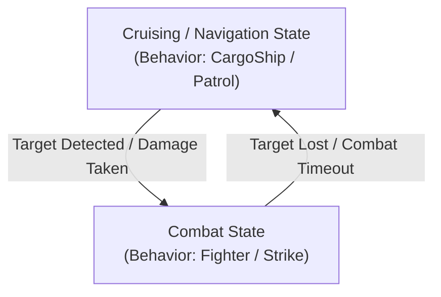

# AI Behaviors, Autopilot & Combat Systems

Architectural guide to RivalAI behavior trees, the 11 behavior subclasses, Enenra's Role vs. CombatType state machine, autopilot configurations, and squad command networks.

---

## 1. The 11 AI Behavior Subclasses

Every RivalAI behavior profile (`[RivalAI Behavior]`) assigns a `[BehaviorName:<Subclass>]` that dictates the grid's core flight and engagement model:

| Subclass | Flight & Combat Logic | Primary Environment | Default Fallback Autopilot Profile |
| :--- | :--- | :--- | :--- |
| **`Passive`** | Stationary or drift; non-navigating. Used for stations, derelicts, and static stores. | All | `RAI-Generic-Autopilot-Passive` |
| **`CargoShip`** | Flies straight between initial spawn and destination despawn waypoint. | Space / Planet | `RAI-Generic-Autopilot-CargoShip` |
| **`Escort`** | Formations with designated leader grid (`LeaderType:Owner/Faction`); breaks formation when engaging. | Space / Planet | `RAI-Generic-Autopilot-Escort` |
| **`Fighter`** | High-speed interceptor; performs strafing runs, breakaway loops, and evasive rolls. | Space / Planet | `RAI-Generic-Autopilot-Fighter` |
| **`HorseFighter`**| Hybrid standoff fighter; orbits target at weapon range, making rapid firing passes. | Space / Planet | `RAI-Generic-Autopilot-HorseFighter` |
| **`Horsefly`** | Standoff skirmisher; maintains distance, orbits target, and fires turreted weaponry. | Space / Planet | `RAI-Generic-Autopilot-Horsefly` |
| **`Hunter`** | Relentless tracker; seeks out high-threat player grids across long distances. | Space / Planet | `RAI-Generic-Autopilot-Hunter` |
| **`Nautical`** | Water Mod naval vessel; adheres to buoyancy surface lines and aquatic pathing. | Planet (Water Mod) | `RAI-Generic-Autopilot-Nautical` |
| **`Scout`** | Reconnaissance craft; patrols waypoints, performs radar scans, calls reinforcements. | Space / Planet | `RAI-Generic-Autopilot-Scout` |
| **`Sniper`** | Extreme long-range artillery; maintains 2km–5km standoff distance with fixed weapons. | Space / Planet | `RAI-Generic-Autopilot-Sniper` |
| **`Strike`** | Heavy attack craft; approaches high, initiates high-speed diving run, breaks off. | Space / Planet | `RAI-Generic-Autopilot-Strike` |

> [!TIP]
> **Autopilot Fallback**: If an encounter does not define `[AutopilotData:<SubtypeId>]`, MES automatically falls back to `RAI-Generic-Autopilot-<BehaviorName>`. Defining custom autopilot profiles is always recommended for fine-tuned combat performance.

---

## 2. Dynamic Behavior Subclass & Autopilot State Switching

MES natively allows an NPC grid to transition between passive navigation and combat states using action tags. Modders can construct state machines using native RivalAI tags:



> [!NOTE]
> Some community mods (such as `mes-shared-behaviors`) use custom strings (`[CustomStrings:Role,...]` / `[CustomStrings:CombatType,...]`) as arbitrary variable names to track states. These are user-defined string conventions, **not** native MES tags. The actual engine mechanisms doing the work are the native tags below.

### State Switching Implementation:
- **Transitioning to Combat**:
  Trigger on `[Type:Damage]` or `[Type:TargetNear]`:
  ```xml
  [RivalAI Action]
  [ChangeBehaviorSubclass:true]
  [NewBehaviorSubclass:Fighter]
  [ChangeAutopilotProfile:true]
  [AutopilotProfile:CombatAutopilot]
  [EnableTriggerTags:InCombat]
  [DisableTriggerTags:Cruising]
  ```
- **Returning to Cruising / Navigation**:
  Trigger on `[Type:NoTargetCheck]` or combat timeout:
  ```xml
  [RivalAI Action]
  [ChangeBehaviorSubclass:true]
  [NewBehaviorSubclass:CargoShip]
  [ChangeAutopilotProfile:true]
  [AutopilotProfile:CruiseAutopilot]
  [EnableTriggerTags:Cruising]
  [DisableTriggerTags:InCombat]
  ```

---

## 3. Autopilot Deep Dive (`[RivalAI Autopilot]`)

### A. Collision Evasion & Planet Flight Rules
- `[UseVelocityCollisionEvasion:true]`: Uses velocity projection vectors to evade asteroids and terrain before impacts occur.
- `[CollisionEvasionWaypointCalculatedAwayFromEntity:true]`: Generates evasion waypoints away from the obstacle rather than toward target.
- `[FlyLevelWithGravity:true]` vs `[UseSurfaceHoverThrustMode:true]`:
  > [!CAUTION]
  > **Hard Conflict**: Never enable both. `FlyLevelWithGravity` aligns the grid's artificial horizon with gravity, while `UseSurfaceHoverThrustMode` forces downward thrusters to maintain a fixed terrain altitude. Combining them causes violent physics oscillation and sim-speed collapse.

### B. Combat Maneuvers & Firing Passes
- `[UseProjectileLeadPrediction:true]`: Calculates target angular velocity and projectile velocity to lead shots.
- `[AllowStrafing:true]`, `[StrafeMinDurationMs:3000]`, `[StrafeMaxDurationMs:6000]`: Lateral thruster bursts during combat.
- `[StrikeBeginPlanetAttackRunDistance:600]`, `[StrikeBreakawayDistance:100]`: Distance thresholds for diving attack runs and breakaways.
- `[BarrelRollMinDurationMs:2000]`, `[BarrelRollMaxDurationMs:3000]`: Evasive corkscrew rolls when targeted by hostile lock.
- `[RamMinDurationMs:6000]`: Emergency kamikaze ramming maneuver when severely damaged.

### C. Speed & Altitude Clamping
- Speed restoration: Using `-1` in `[ChangeAutopilotSpeed:true]` + `[NewAutopilotSpeed:-1]` and `[ChangeAutopilotMinAltitude:true]` + `[NewAutopilotMinAltitude:-1]` cleanly restores the default autopilot values from the profile!

---

## 4. Target Acquisition & Prioritization (`[RivalAI Target]`)

```xml
<EntityComponent xsi:type="MyObjectBuilder_InventoryComponentDefinition">
  <Id>
    <TypeId>Inventory</TypeId>
    <SubtypeId>ModPrefix-Target-CombatFighter</SubtypeId>
  </Id>
  <Description>
    [RivalAI Target]
    [UsePriorities:true]
    [TargetRules:Player]
    [TargetRules:Grid]
    [MaxDistance:4000]
    [MinDistance:10]
    [MatchAllFilters:Relation]
    [MatchAllFilters:Powered]
    [MatchAllFilters:OutsideSafezone]
    [PrioritizeTargetSubsystems:true]
    [TargetSubsystems:Weapons]
    [TargetSubsystems:Thrust]
    [TargetSubsystems:Power]
  </Description>
</EntityComponent>
```

- **TargetSubsystems**: Focuses turret and fixed-weapon fire on specific block types (`Weapons`, `Thrust`, `Power`, `Cockpit`, `Communications`).
- **MatchAllFilters**:
  - `Relation`: Targets only hostile grids (`Enemies`).
  - `Powered`: Ignores unpowered floating wrecks.
  - `OutsideSafezone`: Prevents wasting ammunition against safezone shields.

---

## 5. Squad Command Networks & Parent-Child Logistics

RivalAI allows inter-grid communication using radio commands:

### A. Calling Reinforcements on Damage
1. **Damaged Grid (Caller)**:
   ```xml
   [RivalAI Action]
   [BroadcastCommandProfiles:true]
   [CommandProfileIds:ModPrefix-Command-RequestBackup]
   ```
2. **Command Profile**:
   ```xml
   [RivalAI Command]
   [CommandCode:CallReinforcements]
   [SingleRecipient:false]
   [SendWaypoint:true]
   [MatchSenderReceiverOwners:true]
   [Waypoint:ModPrefix-Waypoint-BackupLocation]
   ```
3. **Patrol Grid (Responder)**:
   Trigger of `[Type:CommandReceived]` with `[CommandReceiveCode:CallReinforcements]`:
   ```xml
   [RivalAI Action]
   [AddWaypointFromCommand:true]
   [ChangeBehaviorSubclass:true]
   [NewBehaviorSubclass:Fighter]
   [ChangeAutopilotProfile:true]
   [AutopilotProfile:Primary]
   ```

### B. Parent-Child Logistics (Enenra GFA Courier Pattern)
- A static station summons a dynamic courier grid (`[SingleRecipient:true]`, `[CommandCheckFromParent:true]`).
- Transmits landing coordinates via `[AddWaypointFromCommand:true]`.
- Courier approaches, reduces altitude (`NewAutopilotMinAltitude:15`), lands, resupplies stock, and retreats.

