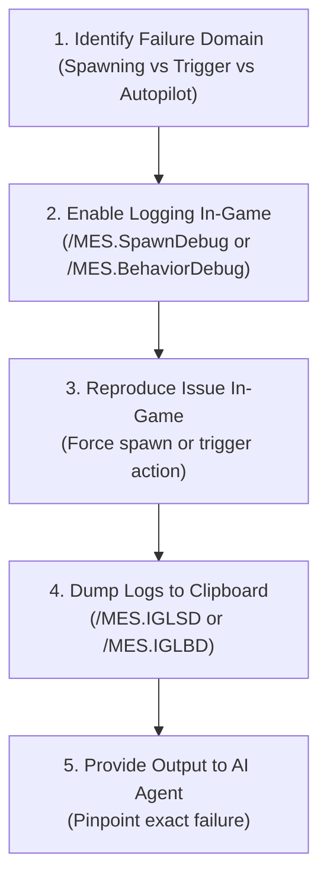

# In-Game Diagnostics, Logging & Troubleshooting Reference

Diagnostic reference covering in-game admin chat commands, log file auditing, sim-speed optimization, anti-clang physics mitigations, and common error signatures.

---

## 1. Action & Trigger Debugging: [DebugMessage] vs. Chat Profiles

When testing whether triggers fire and actions execute, **never create throwaway `[RivalAI Chat]` profiles**. Doing so introduces redundant `<EntityComponent>` blocks, bloats XML, and clutters cross-referencing. Instead, use native MES debug tags:

### A. RivalAI Action Debugging
- **Tag**: `[DebugMessage:<Your Debug Message Here>]`
- **Location**: Inside `[RivalAI Action]` or `[MES AI Action]`.
- **Mechanism** (`ActionSystem.cs:3047`):
  - Sends a chat message to all players attributed to the grid name.
  - Automatically evaluates dynamic replacement tokens: `{Faction}`, `{Position}`, `{PlayerName}`, etc.
  - Automatically evaluates grid custom counter variables: `{<CounterName>}`.
  - Example:
    ```xml
    <Description>
      [RivalAI Action]
      [DebugMessage:TRIGGER FIRED: Health < 50% | Counter: {DamageCounter} | Faction: {Faction}]
      [ChangeBehaviorSubclass:true]
      [NewBehaviorSubclass:Fighter]
    </Description>
    ```

### B. MES Event Action Debugging
- **Tags**: `[DebugChatMessage:<Text>]` and `[DebugHudMessage:<Text>]`
- **Location**: Inside `[MES Event Action]`.
- **Mechanism** (`EventActionExecution.cs:701-716`):
  - `[DebugChatMessage:<Text>]`: Sends an in-game chat message attributed to the Event Action's SubtypeId with token evaluation.
  - `[DebugHudMessage:<Text>]`: Sends an on-screen HUD notification (3000ms duration) and a chat line to all players.
  - Example:
    ```xml
    <Description>
      [MES Event Action]
      [DebugHudMessage:EVENT EXECUTED: Territory Ladder Up triggered!]
      [ChangeCounters:true]
      [IncreaseCounters:TerritoryPoints]
      [IncreaseCountersAmount:10]
    </Description>
    ```

### C. Strict Production Rule
> [!WARNING]
> **Remove Debug Tags Before Production Release**:
> - `[DebugMessage]` is strictly a development diagnostic. It sends raw chat messages to all players without checking player distances, faction relations, broadcast radius, or radio antennas.
> - **Never** use `[DebugMessage]` as a substitute for real NPC chat messages.
> - For in-game player-facing dialogue, always use dedicated `[RivalAI Chat]` profiles configured with proper broadcast ranges (`[ChatRadius:...]`), colors, channels, and audio sound effects.

---

## 2. In-Game Admin Diagnostics & Logging Commands

MES and RivalAI include deep runtime logging and telemetry systems that can be toggled on-the-fly via in-game admin chat.

### A. Spawner Logging (`/MES.SpawnDebug.<Type>.<true/false>`)
Controls verbose diagnostic logging for the encounter spawner. Set `<Type>` to any of the following:

| Spawner Debug Type | Diagnostic Information Logged |
| :--- | :--- |
| `Spawning` | Spawner candidate evaluation, spawn distance checks, and final spawn execution. |
| `SpawnGroup` | Detailed eligibility breakdown (why each spawn group passed or failed its conditions). |
| `Zone` | Zone boundary detection, zone condition filters, and restricted spawn group checks. |
| `Pathing` | Spawner trajectory, altitude checks, and waypoint pathing generation. |
| `Manipulation` | Block replacement, weapon randomization, dereliction damage, and loot injection. |
| `CleanUp` | Grid despawn distance scans, player proximity checks, and cleanup timer evaluations. |
| `PostSpawn` | Post-spawn physics stabilization, ownership assignment, and AI attachment. |
| `GameLog` | Routes all spawner debug messages directly to `SpaceEngineers.log`. |

- **Example**: Enable detailed spawn group condition logging and send output to `SpaceEngineers.log`:
  ```
  /MES.SpawnDebug.SpawnGroup.true
  /MES.SpawnDebug.GameLog.true
  ```

### B. Behavior & AI Logging (`/MES.BehaviorDebug.<Type>.<true/false>`)
Controls verbose diagnostic logging for RivalAI grid behaviors. Set `<Type>` to any of the following:

| Behavior Debug Type | Diagnostic Information Logged |
| :--- | :--- |
| `Trigger` | Condition evaluation results, execution cooldowns, and trigger firing events. |
| `Action` | Action execution steps, variable mutations, and unhandled action failures. |
| `Condition` | Granular condition checks (custom counters, sandbox booleans, distance, speed). |
| `AutoPilot` | Waypoint navigation, collision evasion vectors, and flight mode calculations. |
| `TargetAcquisition`| Target scan passes, relation filtering, and potential target candidate lists. |
| `TargetEvaluation` | Target priority scoring, distance weighting, and subsystem target locking. |
| `Weapon` | WeaponCore/vanilla turret range clamping, firing sequences, and ammo checks. |
| `Command` | Squad radio command transmissions, frequency matches, and recipient processing. |
| `Chat` | Chat broadcast range checks, relation filtering, and broadcast transmission. |
| `Collision` | Raycasting results, asteroid/terrain obstacle avoidance, and evasion maneuvers. |
| `Despawn` | Timeout timers, player distance retreat checks, and force-despawn execution. |
| `BehaviorMode` | Subclass switching (`ChangeBehaviorSubclass`) and state transitions. |
| `GameLog` | Routes all behavior debug messages directly to `SpaceEngineers.log`. |

- **Example**: Track why a combat trigger isn't firing:
  ```
  /MES.BehaviorDebug.Trigger.true
  /MES.BehaviorDebug.Condition.true
  /MES.BehaviorDebug.Action.true
  /MES.BehaviorDebug.GameLog.true
  ```

### C. Clipboard Export Commands (`/MES.Info.*`)
MES can dump internal diagnostic logs directly to your Windows clipboard for fast analysis without digging through log files:

| Chat Command | Shortcut | Data Copied to Windows Clipboard |
| :--- | :--- | :--- |
| `/MES.Info.GetLogging.SpawnDebug` | `/MES.IGLSD` | Dumps the active Spawner debug log buffer to clipboard. |
| `/MES.Info.GetLogging.BehaviorDebug` | `/MES.IGLBD` | Dumps the active Behavior/AI debug log buffer to clipboard. |
| `/MES.Info.GetGridBehavior` | `/MES.IGGB` | Dumps targeted grid's active behavior, autopilot, and trigger states. |
| `/MES.Info.GetGridData` | `/MES.IGGD` | Dumps targeted grid's core MES entity parameters. |
| `/MES.Info.GetEligibleSpawnsAtPosition` | `/MES.GESAP` | Lists all spawn groups eligible to spawn at the player's current location. |
| `/MES.Info.GetThreatScore` | `/MES.GTS` | Calculates and displays player combat threat score at current position. |
| `/MES.Info.GetDiagnostics` | `/MES.IGD` | General diagnostic telemetry dump. |

### D. Spawning & Encounter Force-Spawn Commands
- `/MES.Spawning.Enabled [true/false]`: Globally toggles MES spawning.
- `/MES.Spawn.SpaceCargoShip [SpawnGroupName]` (or `/MES.SSCS`): Forces a space cargo ship spawn near player.
- `/MES.Spawn.PlanetaryCargoShip [SpawnGroupName]` (or `/MES.SPCS`): Forces a planetary cargo ship spawn.
- `/MES.Spawn.PlanetaryInstallation [SpawnGroupName]` (or `/MES.SPI`): Forces a planetary installation spawn.
- `/MES.Spawn.BossEncounter [SpawnGroupName]` (or `/MES.SBE`): Forces a boss encounter spawn.
- `/MES.Spawn.RandomEncounter [SpawnGroupName]` (or `/MES.SRE`): Forces a random encounter spawn.
- `/MES.Spawn.Custom [SpawnGroupName]`: Force-spawns an encounter at the player's crosshair.
- `/MES.Reset.Counters`: Resets all session sandbox counters to 0.
- `/MES.GPS.Encounters [true/false]`: Toggles GPS waypoints for all active MES encounters in the world.

### E. Interactive HUD Overlays (`/RivalAI.*`)
- `/RivalAI.Debug.Toggle`: Toggles on-screen HUD diagnostics showing current behavior state, target coordinates, speed, and active triggers for the targeted grid.
- `/RivalAI.Debug.Triggers`: Dumps a list of all active triggers, cooldowns, and action profiles on the targeted grid's Remote Control block.

---

## 3. The Agent Troubleshooting Protocol (When Something Fails)

When a modder or player reports that an encounter is not spawning, triggers aren't firing, or an NPC is behaving abnormally, the AI agent should guide the user through this systematic protocol:



1. **Step 1: Spawner Failures** (Encounter won't spawn or wrong ship appears):
   - Instruct the user to run:
     ```
     /MES.SpawnDebug.SpawnGroup.true
     /MES.SpawnDebug.Spawning.true
     ```
   - Attempt a spawn (or run `/MES.GESAP` at the intended spawn position).
   - Run `/MES.IGLSD` and paste the clipboard output to the agent.
   - The output will state the exact condition that failed (e.g. `ThreatScore Too High`, `MinAltitude Failed`, `Zone Condition Mismatch`).

2. **Step 2: Trigger / Action Failures** (NPC ignores player, weapons don't shoot, reinforcements don't spawn):
   - Instruct the user to target the grid and run:
     ```
     /MES.BehaviorDebug.Trigger.true
     /MES.BehaviorDebug.Condition.true
     /MES.BehaviorDebug.Action.true
     ```
    - Engage or shoot the grid to trigger the event.
    - Run `/MES.IGLBD` and paste the clipboard output to the agent.
    - The output will identify whether the trigger evaluated false, failed a cooldown check, or threw an action error.

3. **Step 3: Deep-Dive / Complex Issues (The GameLog File Workflow)**:
   - When issues are intermittent, complex, or the clipboard buffer overflows, instruct the user to route debug output directly into Keen's game log:
     ```
     /MES.SpawnDebug.GameLog.true
     /MES.BehaviorDebug.GameLog.true
     ```
   - **Log File Locations**:
     - Client / Singleplayer: `%AppData%\SpaceEngineers\SpaceEngineers.log` or timestamped session logs (e.g. `SpaceEngineers_20260919_090818200.log`).
     - Dedicated Server: `SpaceEngineersDedicated.log` in the server instance folder.
   - **Agent Inspection**: The user points the AI agent directly to the log file path. The agent inspects the file using search tools to trace exact timestamps, tag evaluations, and unhandled exceptions without requiring manual copy-pasting.
   - **Disable When Finished**:
     ```
     /MES.SpawnDebug.GameLog.false
     /MES.BehaviorDebug.GameLog.false
     ```

4. **Step 4: Disable Debugging After Diagnosis**:
   - Instruct the user to disable debug flags to prevent log spam:
     ```
     /MES.SpawnDebug.Spawning.false
     /MES.BehaviorDebug.Trigger.false
     ```

---

## 4. Log Auditing & Common Error Signatures (`SpaceEngineers.log`)

When troubleshooting encounter loading or execution failures, search `SpaceEngineers.log` for the following signatures:

### 1. `System.Xml.XmlException: Unexpected node type Comment`
- **Cause**: XML comment (`<!-- ... -->`) placed inside a `<Description>` tag.
- **Result**: `MOD_CRITICAL_ERROR` — Keen's `ReadElementString()` crashes and skips loading the mod entirely.
- **Fix**: Replace XML comments with RivalAI comment syntax: `[//Comment text]`.

### 2. `Could Not Load Action Profile From Trigger: : [SubtypeId]`
- **Cause**: Duplicate `<SubtypeId>` elements inside a single `<Id>` block.
- **Result**: Deserializer discards the second SubtypeId, leaving the referenced profile undefined.
- **Fix**: Separate into individual `<EntityComponent>` blocks, each with its own `<Id>`.

### 3. `Counter Names and Targets List Counts Don't Match`
- **Cause**: The Zero-Stripping Bug. `TagIntListCheck` in `TagParse.cs` stripped a `0` from `[CustomCountersTargets:0]`.
- **Result**: The condition profile fails to evaluate.
- **Fix**: Use `[CustomCountersTargets:-1]` with `[CounterCompareTypes:LessOrEqual]` or `[CounterCompareTypes:Greater]`.

### 4. `System.ArgumentOutOfRangeException: Index was out of range... CargoShipWaypoints`
- **Cause**: `[Type:WaypointNear]` or `[Type:WaypointFar]` executed when waypoints list was empty or completed.
- **Result**: Breaks the trigger loop on the grid permanently.
- **Fix**: Use `[Type:TargetNear]` / `[Type:TargetFar]` or `[Type:BehaviorTriggerA]` instead.

### 5. `System.IndexOutOfRangeException: Index was outside the bounds of the array... ChangeBlocksShareModeAll`
- **Cause**: Unhandled loop index bug in MES `ActionSystem.cs:2412`.
- **Result**: Throws unhandled exception during action processing.
- **Fix**: Do not use `ChangeBlocksShareModeAll`. Use targeted terminal block actions.

### 6. Prefab SubtypeId vs. File Name Mismatch (Silent Spawn Failure / `Prefab Not Found`)
- **Cause**: The `SpawnGroup` references a prefab by its SubtypeId (e.g. `<Prefabs><Prefab SubtypeId="MyPatrolDrone">`), but the prefab file on disk has a different internal SubtypeId.
- **The Critical Rule**: **Space Engineers and MES completely ignore the prefab's file name on disk** (`MyPatrolDrone.sbc`). Spawning resolves *strictly and exclusively* against the `<Id><SubtypeId>` element declared inside the prefab XML:
  ```xml
  <Prefabs>
    <Prefab>
      <Id>
        <TypeId>MyObjectBuilder_PrefabDefinition</TypeId>
        <SubtypeId>MyPatrolDrone</SubtypeId> <!-- MUST MATCH THE SPAWNGROUP -->
      </Id>
    ...
  ```
- **Symptom**: Spawning silently fails, or `SpaceEngineers.log` reports `Prefab [MyPatrolDrone] was not found in PrefabManager` or `NullReferenceException` in `SpawnProcess`.
- **Fix**: Verify that the `<SubtypeId>` inside `Data/Prefabs/<FileName>.sbc` matches the `SubtypeId` in your `SpawnGroupDefinition` verbatim.

### 7. The `.sbcB5` Stale Binary Cache Trap
- **Cause**: When Space Engineers or the Dedicated Server loads a prefab `.sbc` for the first time, it compiles and caches it into a binary `.sbcB5` file in the same `Data/Prefabs/` folder. When a modder subsequently modifies the prefab `.sbc` (updating blocks, changing names, re-exporting, or tweaking weapon mounts), the game frequently **ignores the updated `.sbc` text file and loads the stale `.sbcB5` binary file instead**.
- **Symptom**:
  - In-game spawned grids do not reflect recent block changes or terminal renames.
  - Spawning fails or throws deserialization errors due to outdated grid offsets.
  - WeaponCore or RivalAI behaviors fail because newly added blocks are missing from the loaded binary cache.
- **Fix**: **Always delete the `.sbcB5` binary file whenever modifying a prefab.**
  ```powershell
  # Remove all stale sbcB5 cache files across prefabs
  Get-ChildItem -Path "Data/Prefabs" -Filter "*.sbcB5" -Recurse | Remove-Item -Force
  ```
  Keen will recompile fresh binary caches from the updated XML on the next world load.

### 8. Spawning As "Nobody" / Inactive AI (Missing or Dead Remote Control)
- **Cause**: The spawned prefab does not contain an undamaged, operational `MyObjectBuilder_RemoteControl` block, or the Remote Control block is not owned by the spawning NPC faction.
- **Result**: The grid spawns as unowned ("Nobody") or drifts inertly without executing its RivalAI behavior profile.
- **Fix**:
  1. Ensure the prefab contains at least one intact Remote Control block.
  2. If the prefab has multiple Remote Controls, ensure `[AssignGridControlToFirstRemote:true]` is set in `[MES Spawn]` or the primary Remote Control has priority.
  3. Ensure ownership is properly assigned via `[FactionOwner:<FactionTag>]` in the `SpawnGroup`.

### 9. Grid Sets Waypoints Properly But Refuses to Tilt Up or Down (Pitch Lock)
- **Cause**:
  1. `[LevelWithGravityWhenIdle:true]` state bleed: In `FighterPlane`, `Strike`, `Sniper`, and `HorseFighter`, entering idle sets `State.UseFlyLevelWithGravityIdle = true`. Because `EngageTarget` omits the idle parameter when calling `ActivateAutoPilot()`, the flag never resets, permanently latching `NewAutoPilotMode.LevelWithGravity` onto combat runs.
  2. `[FlyLevelWithGravity:true]`: Actively forces `LevelWithGravity` across all flight modes in all subclasses.
- **Result**: In `RotationSystem.cs:187`, `LevelWithGravity` forces gyro pitch to align solely with the planetary horizon, completely bypassing `directionToTarget`. The craft yaws toward waypoints but cannot dive to fire fixed guns or pitch up to climb toward breakaway waypoints.
- **Fix**: In the `[RivalAI Autopilot]` profile, explicitly disable both tags:
  ```xml
  [FlyLevelWithGravity:false]
  [LevelWithGravityWhenIdle:false]
  ```

### 10. NPC Reverses Into Space at Max Thrust / Endless Flip-and-Burn Slingshot
- **Cause**: The grid lacks thrusters in all 6 cardinal directions (particularly missing backward/reverse braking thrusters), or exceeds speed tolerance triggering the unsigned scalar reverse trap (`ThrustSystem.cs:250`).
- **Result**:
  1. In `ThrustSystem.cs`, exceeding `MaxSpeed + MaxSpeedTolerance` commands 100% reverse thrust (`SetZ(true, true, 1)`) and drops forward thrusters to `0.0001f`. Without reverse thrusters, braking force is 0.
  2. `CalculateStoppingDistance()` computes 0 stopping distance, causing the grid to blow past waypoints at max speed.
  3. Once past the waypoint, `RotationSystem.cs` rotates the craft 180° to face the waypoint behind it.
  4. Moving backwards relative to its heading at max speed, `velocityToTargetAngle` exceeds `MaxVelocityAngleForSpeedControl`, triggering 100% forward thrust override into deep space.
  5. On rovers, reverse velocity exceeding `MaxSpeed` locks reverse thrust at 100% permanently because `velocity.Length()` is an unsigned scalar.
- **Fix**:
  1. Add at least one working thruster in all six cardinal directions.
  2. For atmospheric aircraft with forward-only thrust, switch behavior subclass to `FighterPlane` (which uses velocity-aligned climbing breakaway without braking).
  3. For thrust-driven rovers, see [behaviors_and_autopilot.md §6.C](file:///c:/Users/blayl/source/repos/se-dev-mes/references/behaviors_and_autopilot.md#c-thrust-driven-rovers--ground-vehicles-best-practices--pitfalls-hard--soft) for the complete rover setup (`[UseSurfaceHoverThrustMode:true]`, `[FlyLevelWithGravity:false]`, and matching `[IdealPlanetAltitude]` to Remote Control height).

### 11. Rover NPC Stalls on Hills, Lifts Wheels, or Backflips Into Sky
- **Cause**:
  1. **Hill Stalling**: `HoverUpAngle` defaults to 10°. Inclines or ramps steeper than 10° trigger `_thrustToApply.SetZ(false, false, 0)`, completely cutting forward thrust.
  2. **Wheel Lifting**: `[FlyLevelWithGravity:true]` forces chassis perpendicular to planetary gravity rather than terrain slope, lifting downhill/uphill wheels off the ground.
  3. **Backflipping on Turns**: Waypoints generated behind the rover create a 90°/90° yaw symmetry deadzone while pitch saturates to 100% override (`Math.PI * 2`).
  4. **Sky Evasion**: Voxel collision raycasts detect ground in all directions except UP, commanding climb evasion into space.
- **Fix**: Apply the golden rover autopilot profile from [behaviors_and_autopilot.md §6.C](file:///c:/Users/blayl/source/repos/se-dev-mes/references/behaviors_and_autopilot.md#c-thrust-driven-rovers--ground-vehicles-best-practices--pitfalls-hard--soft):
  ```xml
  [UseSurfaceHoverThrustMode:true]
  [FlyLevelWithGravity:false]
  [IdealPlanetAltitude:<rc_block_height>]
  [HoverPathStepDistance:50]
  [WaypointTolerance:15]
  [MaxVerticalSpeed:5]
  [RotationMultiplierPitch:0.1]
  [RotationMultiplierYaw:1.5]
  [RotationMultiplierRoll:1.0]
  [UseVelocityCollisionEvasion:false]
  ```
  Also ensure prefab wheel suspension friction is `<= 12%` so gyro yaw torque can pivot the vehicle smoothly.

### 12. Spawn Group Never Spawns / Silent Rejection ("Could Not Get Valid NPC Faction")
- **Cause**: The faction tag specified in `[FactionOwner]`, `[FactionOverride]`, or `[SpawnFactionTags]` does not exist in the world session (due to a typo, e.g. `SPTR` instead of `SPRT`, or because the mod containing `Factions.sbc` is missing or threw an XML deserialization error).
- **Result**: In `SpawnConditions.cs:2144`, `MyAPIGateway.Session.Factions.TryGetFactionByTag()` returns `null`. `ValidNpcFactions()` returns an empty list (`Count == 0`). In `SpawnGroupManager.cs:309`, the spawn group is skipped with `continue;`, permanently locking its natural and admin force-spawn rate to **0%** with no in-game warning or crash.
- **Log Diagnostic**: Search `SpaceEngineers.log` or spawner debug logs for:
  ```text
     - Could Not Get Valid NPC Faction.
  ```
- **Fix**:
  1. Verify the exact spelling of `[FactionOwner:<Tag>]` in `[MES Spawn Conditions]` and `[FactionOverride:<Tag>]` in `[MES Spawn Group]`.
  2. If using custom factions, verify that the defining `Factions.sbc` is loaded in the active world save and contains `<Tag>...</Tag>`.
  3. For unowned derelicts or neutral stations, use the reserved keyword `[FactionOwner:Nobody]`.
  4. Run `powershell -ExecutionPolicy Bypass -File scripts/audit_mes_tags.ps1` to detect undefined faction tags automatically.

---

## 5. Sim-Speed Health & Anti-Clang Physics Mitigations

### A. Voxel Phasing & Solver Saturation
- **The Problem**: High-speed aircraft or rovers crashing into terrain meshes can tunnel past the surface voxel boundary, trapping rigid bodies in continuous Havok collision solver loops and dropping server sim-speed from 1.0 to 0.2.
- **The Solution**:
  1. Disabled aircraft grids should be force-despawned immediately on compromise (`[Type:Compromised]` -> `[ForceDespawn:true]`).
  2. Rovers operating near voxels must maintain `[MinimumPlanetAltitude:15]` or higher to prevent chassis collision clipping.

### B. Raycasting & Trigger Throttling
- Non-urgent distance or condition checks should never run on every frame. Use stepped cooldown intervals (`[MinCooldownMs:5000]`, `[MaxCooldownMs:5001]`) rather than 100ms loops.
- Use `[MatchSenderReceiverOwners:true]` in command profiles to prevent grid-to-grid broadcasts from flooding all network entities.

