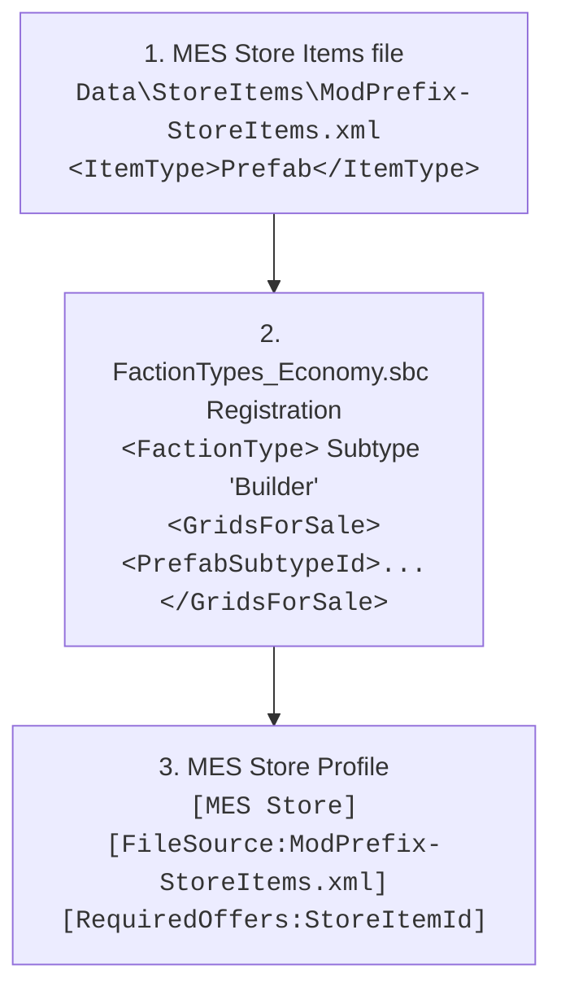
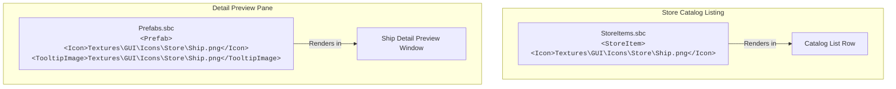

# NPC Economy, Store Blocks & Grid Sales Reference

Comprehensive reference covering Space Engineers economy stores, prefab grid sales, inventory refresh automation, and custom contract generation.

---

## 1. The 3-Part Grid Sales Registration Chain

In Space Engineers, selling modded prefab ships or rovers at NPC economy store blocks requires a strict 3-part registration across an MES store-items XML file, vanilla SBC and an MES profile:



### Part 1: MES Store Items File (`Data\StoreItems\*.xml`)
**[HARD]** MES reads store items from its own XML format, not from vanilla `StoreItemDefinition`s: `ProfileManager.GetStoreItemContainer()` loads `Data\StoreItems\<FileSource>` from any loaded mod and deserializes a `StoreItemsContainer`. For a grid, `ItemType` is `Prefab` and `ItemSubtypeId` is the prefab SubtypeId.

```xml
<?xml version="1.0"?>
<StoreItemsContainer xmlns:xsd="http://www.w3.org/2001/XMLSchema" xmlns:xsi="http://www.w3.org/2001/XMLSchema-instance">
  <StoreItems>
    <StoreItem>
      <StoreItemId>HeavyCruiser</StoreItemId>
      <ItemType>Prefab</ItemType>
      <ItemSubtypeId>ModPrefix-Prefab-HeavyCruiser</ItemSubtypeId>
      <Offer>
        <CustomPrice>15000000</CustomPrice>
        <MinPriceMultiplier>100</MinPriceMultiplier>
        <MaxPriceMultiplier>100</MaxPriceMultiplier>
        <MinAmount>1</MinAmount>
        <MaxAmount>1</MaxAmount>
      </Offer>
    </StoreItem>
  </StoreItems>
</StoreItemsContainer>
```

- `ItemType` values (`StoreProfileItemTypes`): `Ore`, `Ingot`, `Component`, `Ammo`, `Tool`, `Consumable`, `RandomCraftable`, `RandomItem`, `Oxygen`, `Hydrogen`, `Prefab`, `Seed`, `Item`, `Datapad`, `OxygenContainer`, `GasContainer`, `Gas`.
- `StoreItemId` is the name the `[MES Store]` profile uses in `[Offers:]` / `[RequiredOffers:]` / `[Orders:]` / `[RequiredOrders:]`.

### Part 2: `FactionTypes_Economy.sbc` Registration
> [!CAUTION]
> **[HARD] The Builder Subtype Requirement**: In Keen's engine, grid sales **strictly only function** if the prefab is registered under a `<FactionType>` with subtype `Builder` in `<GridsForSale>`. Listing prefabs under other faction types (e.g. Miner, Trader) results in store blocks never offering the grid for sale.

```xml
<Definitions xmlns:xsi="http://www.w3.org/2001/XMLSchema-instance" xmlns:xsd="http://www.w3.org/2001/XMLSchema">
  <FactionTypes>
    <FactionType>
      <Id>
        <TypeId>FactionTypeDefinition</TypeId>
        <SubtypeId>Builder</SubtypeId>
      </Id>
      <GridsForSale>
        <PrefabSubtypeId>ModPrefix-Prefab-HeavyCruiser</PrefabSubtypeId>
      </GridsForSale>
    </FactionType>
  </FactionTypes>
</Definitions>
```

### Part 3: MES Store Profile (`[MES Store]`)
```xml
<EntityComponent xsi:type="MyObjectBuilder_InventoryComponentDefinition">
  <Id>
    <TypeId>Inventory</TypeId>
    <SubtypeId>ModPrefix-StoreProfile-HeavyCruiser</SubtypeId>
  </Id>
  <Description>
    [MES Store]
    [FileSource:ModPrefix-StoreItems.xml]
    [MinOfferItems:1]
    [MaxOfferItems:1]
    [RequiredOffers:HeavyCruiser]
  </Description>
</EntityComponent>
```

- `[FileSource:]`: File name under `Data\StoreItems\` (Part 1).
- `[Offers:]` / `[Orders:]`: StoreItemIds eligible for random selection; `[RequiredOffers:]` / `[RequiredOrders:]`: always listed.
- `[Min/MaxOfferItems:]`, `[Min/MaxOrderItems:]`: How many items the refresh rolls.
- `[AddedItemsCombineQuantity:]`, `[AddedItemsAveragePrice:]`, `[EqualizeOffersAndOrders:]`.
- There is no `[StoreItems:]` or `[ItemsRequireInventory:]` tag; MES ignores both.

---

## 2. Automated Store Refreshing (Mike Dude's GVK Pattern)

In long-running multiplayer worlds, economy station store inventories become depleted or cluttered. RivalAI actions can dynamically refresh store inventories on a timer:

```xml
<EntityComponent xsi:type="MyObjectBuilder_InventoryComponentDefinition">
  <Id>
    <TypeId>Inventory</TypeId>
    <SubtypeId>GVK-Store-Action-UpdateRoverSales</SubtypeId>
  </Id>
  <Description>
    [MES AI Action]
    [ApplyStoreProfiles:true]
    [ClearStoreContentsFirst:true]
    [StoreBlocks:Store-Rovers]
    [StoreProfiles:GVK-Store-StoreProfile-BasicVehicles]
  </Description>
</EntityComponent>
```

- `[ApplyStoreProfiles:true]`: Pushes fresh store profiles to matching blocks.
- `[ClearStoreContentsFirst:true]`: Flushes old or empty listings.
- `[StoreBlocks:<TerminalName>]`: Targets specific store terminal blocks on the station grid.

---

## 3. Physical Clearance & Icon Requirements

### A. 124m Physical Clearance
- **[HARD]**: When a player purchases a grid from a store block, Keen's engine scans a **124m radius sphere** from the store block's spawn location.
- If physical voxel terrain, station structures, or player safezones obstruct this 124m radius, the purchase will fail with `Area Obstructed`.

### B. Icons & Tooltip Images
- **[SOFT] PNG vs DDS**: DDS textures for prefab store previews frequently fail to load or become corrupted in the client cache. Always use **256x256 PNG** files for `<Icon>` and `<TooltipImage>`.
- **[HARD] Keen Store Icon Bug (Topic 49223)**: Mod-added ships in economy stores have an engine bug where preview icons occasionally fail to render until the client `.sbcB5` cache is regenerated.
### C. Store Icons & Preview Thumbnails

Getting prefab thumbnails to render correctly in economy store blocks requires navigating three specific engine requirements:



1. **The Dual Declaration Requirement (Catalog List vs. Preview Pane)**:
   - **`<StoreItem>` Definition (`StoreItems.sbc`)**: Must include `<Icon>` when the store uses vanilla `StoreItemDefinition`s. MES store-item XML (§1 Part 1) has no icon field, so for MES-stocked grids the prefab's own icons below are what render.
   - **`<Prefab>` Definition (`Prefabs.sbc`)**: Must include **both** `<Icon>` and `<TooltipImage>`.
   - **[HARD] The Missing Preview Bug**: Keen's store block UI queries `<TooltipImage>` when a player clicks a ship to view its stats. If `<TooltipImage>` is omitted from the prefab definition, the preview pane renders completely blank/transparent.

2. **Image Format & Resolution (DDS vs. PNG)**:
   - **Modern Standard (BC7 DDS)**: In modern Space Engineers (DX11), **BC7** is the gold standard for GUI icons and store thumbnails. It provides superior compression quality without the blocky color artifacts of older formats:
     ```bash
     texconv.exe -f BC7_UNORM_SRGB -m 1 -y InputIcon.png -o OutputFolder/
     ```
   - **Legacy Fallback (BC3 / DXT5 DDS)**:
     ```bash
     texconv.exe -f BC3_UNORM -m 1 -srgb -y InputIcon.png -o OutputFolder/
     ```
   - **The #1 DDS Trap: Mipmaps (`-m 1`)**:
     - When saving DDS icons, **never generate a mipmap chain (hard cap to 1 mip level)**.
     - If mipmaps are included, Keen's texture streaming system treats the icon like a 3D model texture. On clients with Texture Quality set to Medium or Low, the game displays a low-resolution mip (e.g. 16x16 or 32x32), turning the store icon into blurry mud.
   - **Dimensions**: Must be **Power of Two (POT)** (256x256 or 512x512) with a 1:1 square aspect ratio. Non-square textures stretch and distort.
   - **Color Space & Alpha**: Always use **sRGB** (prevents washed-out colors) and **straight alpha** (prevents dark fringe halos around edges).
   - **PNG Fallback**: Standard 256x256 32-bit RGBA PNG files work cleanly if you do not want to run a DDS conversion pipeline.

3. **Pathing Syntax**:
   - Must be mod-root relative: e.g. `Textures\GUI\Icons\Store\ModPrefix_HeavyCruiser.png`.
   - **Always use Windows backslashes (`\`)**: Forward slashes (`/`) cause Keen's content loader on Windows dedicated servers to fail file resolution.

4. **The Client `.sbcB5` Binary Cache Trap (Keen Bug Topic 49223)**:
   - Keen precompiles SBC files into binary `.sbcB5` cache files in `%AppData%\SpaceEngineers\Cache\`.
   - When a mod updates an icon path or adds a new store prefab, clients frequently retain stale null references from their cached `.sbcB5` file.
   - **Resolution**: Clients must clear their `.sbcB5` cache, or the mod author must update the mod version/timestamp to force cache regeneration.

