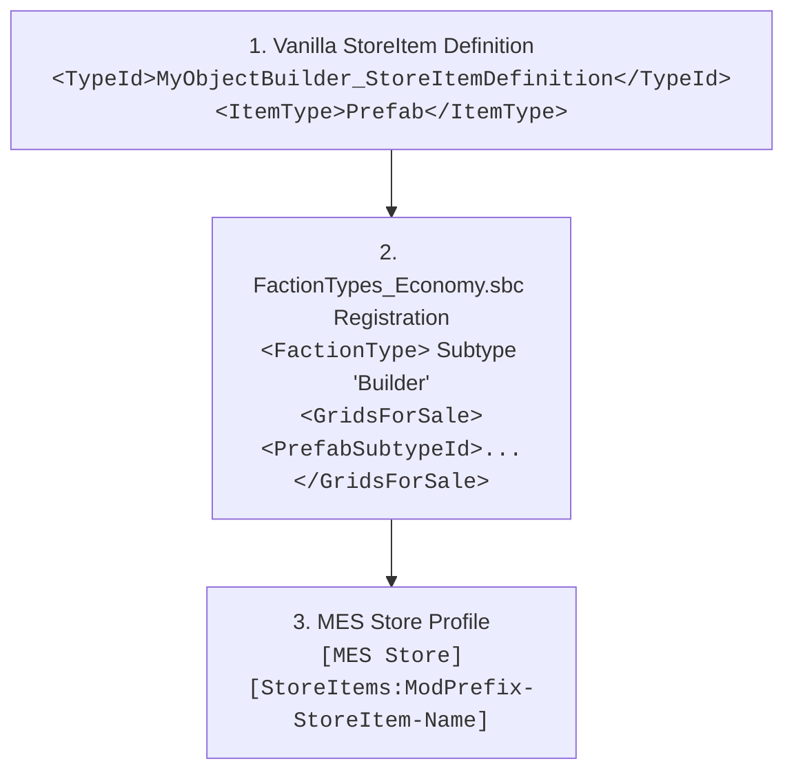

# NPC Economy, Store Blocks & Grid Sales Reference

Comprehensive reference covering Space Engineers economy stores, prefab grid sales, inventory refresh automation, and custom contract generation.

---

## 1. The 3-Part Grid Sales Registration Chain

In Space Engineers, selling modded prefab ships or rovers at NPC economy store blocks requires a strict 3-part registration across vanilla SBC and MES profiles:



### Part 1: Vanilla StoreItem Definition
```xml
<StoreItems>
  <StoreItem>
    <Id>
      <TypeId>MyObjectBuilder_StoreItemDefinition</TypeId>
      <SubtypeId>ModPrefix-StoreItem-HeavyCruiser</SubtypeId>
    </Id>
    <ItemType>Prefab</ItemType>
    <ItemPrefabName>ModPrefix-Prefab-HeavyCruiser</ItemPrefabName>
    <PricePerUnit>15000000</PricePerUnit>
    <Amount>1</Amount>
  </StoreItem>
</StoreItems>
```

### Part 2: `FactionTypes_Economy.sbc` Registration
> [!CAUTION]
> **[HARD] The Builder Subtype Requirement**: In Keen's engine, grid sales **strictly only function** if the prefab is registered under a `<FactionType>` with subtype `Builder` in `<GridsForSale>`. Listing prefabs under other faction types (e.g. Miner, Trader) results in store blocks never offering the grid for sale.

```xml
<Definitions xmlns:xsi="http://www.w3.org/2001/XMLSchema-instance" xmlns:xsd="http://www.w3.org/2001/XMLSchema">
  <FactionTypes>
    <FactionType>
      <Id>
        <TypeId>FactionTypeDefinition</TypeId>
        <SubtypeId>Builder</SubtypeId>
      </Id>
      <GridsForSale>
        <PrefabSubtypeId>ModPrefix-Prefab-HeavyCruiser</PrefabSubtypeId>
      </GridsForSale>
    </FactionType>
  </FactionTypes>
</Definitions>
```

### Part 3: MES Store Profile (`[MES Store]`)
```xml
<EntityComponent xsi:type="MyObjectBuilder_InventoryComponentDefinition">
  <Id>
    <TypeId>Inventory</TypeId>
    <SubtypeId>ModPrefix-StoreProfile-HeavyCruiser</SubtypeId>
  </Id>
  <Description>
    [MES Store]
    [StoreItems:ModPrefix-StoreItem-HeavyCruiser]
  </Description>
</EntityComponent>
```

---

## 2. Automated Store Refreshing (Mike Dude's GVK Pattern)

In long-running multiplayer worlds, economy station store inventories become depleted or cluttered. RivalAI actions can dynamically refresh store inventories on a timer:

```xml
<EntityComponent xsi:type="MyObjectBuilder_InventoryComponentDefinition">
  <Id>
    <TypeId>Inventory</TypeId>
    <SubtypeId>GVK-Store-Action-UpdateRoverSales</SubtypeId>
  </Id>
  <Description>
    [MES AI Action]
    [ApplyStoreProfiles:true]
    [ClearStoreContentsFirst:true]
    [StoreBlocks:Store-Rovers]
    [StoreProfiles:GVK-Store-StoreProfile-BasicVehicles]
  </Description>
</EntityComponent>
```

- `[ApplyStoreProfiles:true]`: Pushes fresh store profiles to matching blocks.
- `[ClearStoreContentsFirst:true]`: Flushes old or empty listings.
- `[StoreBlocks:<TerminalName>]`: Targets specific store terminal blocks on the station grid.

---

## 3. Physical Clearance & Icon Requirements

### A. 124m Physical Clearance
- **[HARD]**: When a player purchases a grid from a store block, Keen's engine scans a **124m radius sphere** from the store block's spawn location.
- If physical voxel terrain, station structures, or player safezones obstruct this 124m radius, the purchase will fail with `Area Obstructed`.

### B. Icons & Tooltip Images
- **[SOFT] PNG vs DDS**: DDS textures for prefab store previews frequently fail to load or become corrupted in the client cache. Always use **256x256 PNG** files for `<Icon>` and `<TooltipImage>`.
- **[HARD] Keen Store Icon Bug (Topic 49223)**: Mod-added ships in economy stores have an engine bug where preview icons occasionally fail to render until the client `.sbcB5` cache is regenerated.

