# MES & RivalAI Profile Catalog & Tag Reference

Comprehensive catalog of all Modular Encounters Systems (MES) and RivalAI profile types, `<Description>` header tags, registration phases in `ProfileManager.cs`, and expected tag data types.

---

## 1. Profile Manager Architecture & Registration Phases

When Space Engineers initializes, MES processes all `MyObjectBuilder_InventoryComponentDefinition` elements across 5 sequential phases in `ProfileManager.Setup()`.

```mermaid
flowchart TD
    subgraph P1 ["Phase 1: Foundation Profiles"]
        direction TB
        p1["• [MES Block Replacement] ➔ BlockReplacementProfile<br/>• [MES Dereliction] ➔ DerelictionProfile<br/>• [MES Faction Icon] ➔ FactionIconProfile<br/>• [MES Loot] ➔ LootProfile<br/>• [MES Store] ➔ StoreProfile<br/>• [MES Contract Block] ➔ ContractBlockProfile<br/>• [MES Weapon Mod Rules] ➔ WeaponModRulesProfile<br/>• [MES Zone] ➔ Zone<br/>• [MES Zone Conditions] ➔ ZoneConditionsProfile<br/>• [MES Bot Spawn] ➔ BotSpawnProfile<br/>• [RivalAI Chat] / [MES AI Chat] ➔ ChatProfile<br/>• [RivalAI Spawn] / [MES AI Spawn] ➔ SpawnProfile<br/>• [MES SafeZone] ➔ SafeZoneProfile"]
    end
    subgraph P2 ["Phase 2: Encounters, Actions & Conditions"]
        direction TB
        p2["• [MES Loot Group] ➔ LootGroup<br/>• [MES Shipyard] ➔ ShipyardProfile<br/>• [MES Replenishment] ➔ ReplenishmentProfile<br/>• [MES Manipulation] ➔ ManipulationProfile<br/>• [MES Spawn Conditions] ➔ SpawnConditionsProfile<br/>• [MES Static Encounter] ➔ StaticEncounter<br/>• [MES Suit Upgrades] ➔ SuitUpgradesProfile<br/>• [RivalAI Action] / [MES AI Action] ➔ ActionProfile<br/>• [RivalAI Condition] / [MES AI Condition] ➔ ConditionProfile<br/>• [RivalAI Target] / [MES AI Target] ➔ TargetProfile<br/>• [MES Event Action] ➔ EventActionProfile<br/>• [MES Event Condition] ➔ EventCondition<br/>• [MES Player Condition] ➔ PlayerCondition"]
    end
    subgraph P3 ["Phase 3: Events & Triggers"]
        direction TB
        p3["• [MES Manipulation Group] ➔ ManipulationGroup<br/>• [MES Spawn Conditions Group] ➔ SpawnConditionsGroup<br/>• [RivalAI Trigger] / [MES AI Trigger] ➔ TriggerProfile<br/>• [MES Event] ➔ EventProfile<br/>• [MES Mission] ➔ MissionProfile"]
    end
    subgraph P4 ["Phase 4: Autopilot, Groups, Commands & Weapons"]
        direction TB
        p4["• [MES Prefab Data] ➔ PrefabDataProfile<br/>• [MES Prefab Gravity] ➔ PrefabGravityProfile<br/>• [RivalAI Autopilot] / [MES AI Autopilot] ➔ AutoPilotProfile<br/>• [MES Event TemplateGroup] ➔ TemplateEventGroup<br/>• [RivalAI TriggerGroup] / [MES AI TriggerGroup] ➔ TriggerGroupProfile<br/>• [RivalAI Waypoint] / [MES AI Waypoint] ➔ WaypointProfile<br/>• [RivalAI Weapons] / [MES AI Weapons] ➔ WeaponSystemReference<br/>• [RivalAI Command] / [MES AI Command] ➔ CommandProfile<br/>• RivalAI-Datapad* ➔ DatapadTemplates"]
    end
    subgraph P5 ["Phase 5: Behaviors & State Machines"]
        direction TB
        p5["• [RivalAI Behavior] / [MES AI Behavior] ➔ BehaviorTemplates<br/>Subclasses: CoreBehavior, CargoShip, Fighter, HorseFighter, Horsefly, Hunter, Nautical, Passive, Scout, Sniper, Strike"]
    end

    P1 --> P2 --> P3 --> P4 --> P5
```

---

## 2. Profile Definitions & Header Syntax

Every profile must be defined inside an `<EntityComponent xsi:type="MyObjectBuilder_InventoryComponentDefinition">` block with a single `<SubtypeId>` and its configuration declared inside `<Description>`.

### A. Behavior Profiles
- **Header**: `[RivalAI Behavior]` or `[MES AI Behavior]`
- **Key Tags**:
  - `[BehaviorName:<Subclass>]`: `Passive`, `CargoShip`, `Escort`, `Fighter`, `HorseFighter`, `Horsefly`, `Hunter`, `Nautical`, `Scout`, `Sniper`, `Strike`.
  - `[AutopilotData:<SubtypeId>]`: Reference to `[RivalAI Autopilot]`.
  - `[TargetData:<SubtypeId>]`: Reference to `[RivalAI Target]`.
  - `[WeaponProfiles:<SubtypeId>]`: Reference to `[RivalAI Weapons]`.
  - `[Triggers:<SubtypeId>]`: Direct trigger references (can specify multiple).
  - `[TriggerGroups:<SubtypeId>]`: Modular trigger group references (can specify multiple).
  - `[RemoteControlCode:<string>]`: Custom identifier tag for grid targeting and commands.
  - `[UseRetreatTimer:bool]`, `[UseNoTargetTimer:bool]`, `[UsePlayerDistanceTimer:bool]`: Default timeout gates.

### B. Trigger Profiles
- **Header**: `[RivalAI Trigger]` or `[MES AI Trigger]`
- **Required Gate**: `[UseTrigger:true]` (Omission causes the trigger to never fire).
- **Key Tags**:
  - `[Type:<TriggerType>]`:
    - `Timer`: Periodic time check via `MinCooldownMs` and `MaxCooldownMs`.
    - `PlayerNear`: Fires when a player enters `TargetDistance`.
    - `TargetNear` / `TargetFar`: Fires based on distance to target grid.
    - `Damage`: Fires when grid takes physical or grinder damage.
    - `Compromised`: Fires when grid power, cockpit, or key blocks are destroyed.
    - `CommandReceived`: Fires on receiving a broadcast code (`CommandReceiveCode`).
    - `BehaviorTriggerA` / `B` / `C` / `D` / `E`: Triggered internally by AI behaviors (e.g. waypoint arrival, strike breakaway).
    - `Manual`: Fires only when called via `[ManuallyActivateTrigger:true]`.
    - `Session`: Fires once per game session/load.
  - `[StartsReady:bool]`: If `true`, fires immediately on spawn without waiting for initial cooldown.
  - `[MaxActions:<int>]`: Execution limit (`-1` = infinite, `1` = one-shot).
  - `[Conditions:<SubtypeId>]`: Reference to `[RivalAI Condition]`.
  - `[Actions:<SubtypeId>]`: Reference to `[RivalAI Action]`.
  - `[ToggleWithTriggerProfile:<SubtypeId>]`: Mutually exclusive trigger toggle.
  - `[ToggledProfileResetsCooldown:bool]`: Resets paired trigger timer on toggle.

### C. Action Profiles (RivalAI Grid-Bound)
- **Header**: `[RivalAI Action]` or `[MES AI Action]`
- **Key Capabilities**:
  - **Spawning**: `[SpawnEncounter:true]` + `[Spawner:<SubtypeId>]`.
  - **Chat/Audio**: `[UseChatBroadcast:true]` + `[ChatData:<SubtypeId>]`, `[PlayDialogueCue:true]` + `[DialogueCueId:<string>]`.
  - **Weapons**: `[SetWeaponsToMaxRange:true]`, `[EnableWeaponRandomizer:true]`.
  - **Autopilot**: `[ChangeAutopilotProfile:true]` + `[AutopilotProfile:Primary/Secondary]`, `[ChangeAutopilotSpeed:true]` + `[NewAutopilotSpeed:<float>]`, `[ChangeAutopilotMinAltitude:true]` + `[NewAutopilotMinAltitude:<float>]` (use `-1` to reset).
  - **Trigger Control**: `[EnableTriggers:true]` + `[EnableTriggerNames:...]`, `[DisableTriggers:true]` + `[DisableTriggerNames:...]`, `[ResetCooldownTimeOfTriggers:true]` + `[ResetTriggerCooldownNames:...]`.
  - **Tag-Based Trigger Control**: `[EnableTriggerTags:...]`, `[DisableTriggerTags:...]`.
  - **Command Broadcasting**: `[BroadcastCommandProfiles:true]` + `[CommandProfileIds:...]`.
  - **Store Updates**: `[ApplyStoreProfiles:true]`, `[ClearStoreContentsFirst:true]`, `[StoreBlocks:...]`, `[StoreProfiles:...]`.
  - **Container Loot**: `[ApplyContainerTypeToInventoryBlock:true]` + `[ContainerTypeBlockNames:...]` + `[ContainerTypeSubtypeIds:...]`.
  - **SafeZone Generation**: `[CreateSafeZone:true]`, `[SafeZoneProfile:...]`, `[LinkSafeZoneToRemoteControl:true]`, `[SafeZonePositionGridCenter:true]`.
  - **Despawn/Retreat**: `[Retreat:true]`, `[ForceDespawn:true]`.
  - **Diagnostic Debugging**: `[DebugMessage:<Text>]` (Direct chat test message with token evaluation; do not use in production).

### D. Condition Profiles (RivalAI Grid-Bound)
- **Header**: `[RivalAI Condition]` or `[MES AI Condition]`
- **Required Gate**: `[UseConditions:true]`
- **Key Tags**:
  - `[MatchAnyCondition:bool]`: If `false` (default), all conditions must match (AND). If `true`, any match passes (OR).
  - `[CheckGridSpeed:bool]`, `[MinGridSpeed:<float>]`, `[MaxGridSpeed:<float>]`.
  - `[CheckPlayerNear:bool]`, `[PlayerNearDistance:<double>]`.
  - `[CheckPlayerReputation:bool]`, `[MinPlayerReputation:<int>]`, `[MaxPlayerReputation:<int>]`.
  - `[CheckCustomCounters:bool]`, `[CustomCounters:<string>]`, `[CustomCountersTargets:<int>]`, `[CounterCompareTypes:<Enum>]`.
  - `[CheckCommandFromParent:bool]`, `[CommandFromParent:bool]`.

### E. Autopilot Profiles
- **Header**: `[RivalAI Autopilot]` or `[MES AI Autopilot]`
- **Key Tags**:
  - `[IdealMinSpeed:<float>]`, `[IdealMaxSpeed:<float>]`, `[MaxSpeedTolerance:<float>]`.
  - `[MinimumPlanetAltitude:<float>]`, `[IdealPlanetAltitude:<float>]`, `[AltitudeTolerance:<float>]`.
  - `[WaypointTolerance:<float>]`, `[SlowDownOnWaypointApproach:bool]`, `[ExtraSlowDownDistance:<float>]`.
  - `[FlyLevelWithGravity:bool]` vs `[UseSurfaceHoverThrustMode:bool]` (MUTUALLY EXCLUSIVE).
  - `[UseVelocityCollisionEvasion:bool]`, `[CollisionEvasionWaypointCalculatedAwayFromEntity:bool]`.
  - `[AllowStrafing:bool]`, `[StrafeMinDurationMs:<int>]`, `[StrafeMaxDurationMs:<int>]`.
  - `[UseProjectileLeadPrediction:bool]`.
  - `[StrikeBeginPlanetAttackRunDistance:<float>]`, `[StrikeBreakawayDistance:<float>]`.
  - `[BarrelRollMinDurationMs:<int>]`, `[RamMinDurationMs:<int>]`.

### F. Target Profiles
- **Header**: `[RivalAI Target]` or `[MES AI Target]`
- **Key Tags**:
  - `[UsePriorities:bool]`.
  - `[TargetRules:Player]`, `[TargetRules:Grid]`, `[TargetRules:Air]`, `[TargetRules:Water]`.
  - `[MaxDistance:<double>]`, `[MinDistance:<double>]`.
  - `[MatchAllFilters:Relation]`, `[MatchAllFilters:Powered]`, `[MatchAllFilters:OutsideSafezone]`.
  - `[PrioritizeTargetSubsystems:true]`, `[TargetSubsystems:Weapons]`, `[TargetSubsystems:Thrust]`, `[TargetSubsystems:Power]`.

### G. MES Event Profiles (Global Session-Bound)
- **Header**: `[MES Event]`
- **Key Tags**:
  - `[UseEvent:true]`.
  - `[UniqueEvent:bool]`: If `true`, runs only once per world save.
  - `[MinCooldownMs:<int>]`, `[MaxCooldownMs:<int>]`.
  - `[ConditionIds:<SubtypeId>]`: Reference to `[MES Event Condition]`.
  - `[ActionIds:<SubtypeId>]`: Reference to `[MES Event Action]`.
  - `[ActionExecution:<Enum>]`: `All` (runs all actions) or `Condition` (runs actions mapped 1:1 to passed conditions).

### H. MES Event Action Profiles
- **Header**: `[MES Event Action]`
- **Master Gates Required**:
  - `[ChangeCounters:true]` -> `[SetCounters:]`, `[IncreaseCounters:]`, `[DecreaseCounters:]`.
  - `[ChangeBooleans:true]` -> `[SetBooleansTrue:]`, `[SetBooleansFalse:]`.
  - `[SpawnEncounter:true]` -> `[SpawnCoords:]`, `[SpawnFactionTags:]`, `[SpawnData:]`.
  - `[ChangeZoneByName:true]` -> `[ZoneNames:]`, `[ZoneRadiusChangeTypes:]`, `[ZoneRadiusChangeAmounts:]`.
  - `[ToggleEvents:true]` -> `[ToggleEventIds:]`, `[ToggleEventIdModes:]`.
  - `[UseChatBroadcast:true]` -> `[ChatData:]`.

### I. MES Event Condition Profiles
- **Header**: `[MES Event Condition]`
- **Master Gates Required**:
  - `[CheckCustomCounters:true]` -> `[CustomCounters:]`, `[CustomCountersTargets:]`, `[CounterCompareTypes:]`.
  - `[CheckTrueBooleans:true]` -> `[TrueBooleans:]`.
  - `[CheckFalseBooleans:true]` -> `[FalseBooleans:]`.
  - `[CheckPlayerNear:true]` -> `[PlayerNearCoords:]`, `[PlayerNearDistanceFromCoords:]`.
  - `[CheckThreatScore:true]` -> `[ThreatScoreAmount:]`, `[ThreatScoreDistance:]`.

### J. Manipulation Profiles
- **Header**: `[MES Manipulation]`
- **Key Tags**:
  - `[UseBlockReplacer:bool]`, `[BlockReplacementProfiles:<SubtypeId>]`.
  - `[UseWeaponRandomizer:bool]`, `[WeaponRandomizerTargetWhitelist:...]`, `[WeaponRandomizerTargetBlacklist:...]`.
  - `[ClearExistingContainerTypes:bool]`.
  - `[AssignContainerTypesToAllCargo:<ContainerTypeId>]`.
  - `[UseContainerTypeAssignment:true]` -> `[ContainerTypeAssignBlockName:<TerminalName>]`, `[ContainerTypeAssignSubtypeId:<ContainerTypeId>]` (counts must match 1:1), or `[ContainerTypeAssignmentReference:{BlockName:ContainerTypeId}]`.
  - `[ArmorSkins:<string>]`, `[RecolorOld:<Vector3D>]`, `[RecolorNew:<Vector3D>]`.
  - `[ConvertToAtmospheric:bool]`, `[ConvertToHydrogen:bool]`.

### K. Loot Profiles
- **Header**: `[MES Loot]`
- **Key Tags**:
  - `[ContainerTypes:<ContainerTypeId>]`.
  - `[ContainerBlockTypes:<TypeId/SubtypeId>]`.
  - `[MinBlocks:<int>]`, `[MaxBlocks:<int>]`.
  - `[AppendNameToBlock:bool]`, `[AppendedName:<string>]` (Note: suffix often fails to apply in MES due to engine bug).
  - `[AddDatapads:bool]`, `[DatapadFileSource:<SubtypeId>]`, `[DatapadCount:<int>]`.

---

## 3. Tag Data Types & Syntax Reference

| Parser Function in MES | SBC Tag Syntax | Expected Format / Example |
| :--- | :--- | :--- |
| `TagBoolCheck` | `[TagName:true]` | `true` or `false` (all lowercase) |
| `TagStringCheck` | `[TagName:Value]` | Plain text string |
| `TagStringListCheck` | `[TagName:ValA,ValB]` | Comma-separated strings |
| `TagIntCheck` | `[TagName:10]` | Integer number |
| `TagIntListCheck` | `[TagName:10,20]` | Comma-separated integers (**Note: strips 0 in certain tags**) |
| `TagFloatCheck` | `[TagName:15.5]` | Decimal number |
| `TagDoubleCheck` | `[TagName:25000.0]` | High-precision decimal number |
| `TagVector3DCheck` | `[TagName:{X:0 Y:0 Z:0}]` | 3D vector coordinates |
| `TagVector3DListCheck` | `[TagName:{X:0...},{X:1...}]` | Comma-separated 3D vectors |
| `TagCompareEnumCheck` | `[TagName:GreaterOrEqual]` | `Greater`, `GreaterOrEqual`, `Less`, `LessOrEqual`, `Equal`, `NotEqual` |
| `TagDirectionEnumCheck`| `[TagName:Forward]` | `Forward`, `Backward`, `Left`, `Right`, `Up`, `Down` |

