# MES & RivalAI Profile Catalog & Tag Reference

Comprehensive catalog of all Modular Encounters Systems (MES) and RivalAI profile types, `<Description>` header tags, registration phases in `ProfileManager.cs`, and expected tag data types.

---

## 1. Profile Manager Architecture & Registration Phases

When Space Engineers initializes, MES processes all `MyObjectBuilder_InventoryComponentDefinition` elements across 5 sequential phases in `ProfileManager.Setup()`.

```mermaid
flowchart TD
    subgraph P1 ["Phase 1: Foundation Profiles"]
        direction TB
        p1["• [MES Block Replacement] ➔ BlockReplacementProfile<br/>• [MES Dereliction] ➔ DerelictionProfile<br/>• [MES Faction Icon] ➔ FactionIconProfile<br/>• [MES Loot] ➔ LootProfile<br/>• [MES Store] ➔ StoreProfile<br/>• [MES Contract Block] ➔ ContractBlockProfile<br/>• [MES Weapon Mod Rules] ➔ WeaponModRulesProfile<br/>• [MES Zone] ➔ Zone<br/>• [MES Zone Conditions] ➔ ZoneConditionsProfile<br/>• [MES Bot Spawn] ➔ BotSpawnProfile<br/>• [RivalAI Chat] / [MES AI Chat] ➔ ChatProfile<br/>• [RivalAI Spawn] / [MES AI Spawn] ➔ SpawnProfile<br/>• [MES SafeZone] ➔ SafeZoneProfile"]
    end
    subgraph P2 ["Phase 2: Encounters, Actions & Conditions"]
        direction TB
        p2["• [MES Loot Group] ➔ LootGroup<br/>• [MES Shipyard] ➔ ShipyardProfile<br/>• [MES Replenishment] ➔ ReplenishmentProfile<br/>• [MES Manipulation] ➔ ManipulationProfile<br/>• [MES Spawn Conditions] ➔ SpawnConditionsProfile<br/>• [MES Static Encounter] ➔ StaticEncounter<br/>• [MES Suit Upgrades] ➔ SuitUpgradesProfile<br/>• [RivalAI Action] / [MES AI Action] ➔ ActionProfile<br/>• [RivalAI Condition] / [MES AI Condition] ➔ ConditionProfile<br/>• [RivalAI Target] / [MES AI Target] ➔ TargetProfile<br/>• [MES Event Action] ➔ EventActionProfile<br/>• [MES Event Condition] ➔ EventCondition<br/>• [MES Player Condition] ➔ PlayerCondition"]
    end
    subgraph P3 ["Phase 3: Events & Triggers"]
        direction TB
        p3["• [MES Manipulation Group] ➔ ManipulationGroup<br/>• [MES Spawn Conditions Group] ➔ SpawnConditionsGroup<br/>• [RivalAI Trigger] / [MES AI Trigger] ➔ TriggerProfile<br/>• [MES Event] ➔ EventProfile<br/>• [MES Mission] ➔ MissionProfile"]
    end
    subgraph P4 ["Phase 4: Autopilot, Groups, Commands & Weapons"]
        direction TB
        p4["• [MES Prefab Data] ➔ PrefabDataProfile<br/>• [MES Prefab Gravity] ➔ PrefabGravityProfile<br/>• [RivalAI Autopilot] / [MES AI Autopilot] ➔ AutoPilotProfile<br/>• [MES Event TemplateGroup] ➔ TemplateEventGroup<br/>• [RivalAI TriggerGroup] / [MES AI TriggerGroup] ➔ TriggerGroupProfile<br/>• [RivalAI Waypoint] / [MES AI Waypoint] ➔ WaypointProfile<br/>• [RivalAI Weapons] / [MES AI Weapons] ➔ WeaponSystemReference<br/>• [RivalAI Command] / [MES AI Command] ➔ CommandProfile<br/>• RivalAI-Datapad* ➔ DatapadTemplates"]
    end
    subgraph P5 ["Phase 5: Behaviors & State Machines"]
        direction TB
        p5["• [RivalAI Behavior] / [MES AI Behavior] ➔ BehaviorTemplates<br/>Subclasses: CoreBehavior, CargoShip, Fighter, HorseFighter, Horsefly, Hunter, Nautical, Passive, Scout, Sniper, Strike"]
    end

    P1 --> P2 --> P3 --> P4 --> P5
```



---

## 2. Profile Definitions & Header Syntax

Every profile must be defined inside an `<EntityComponent xsi:type="MyObjectBuilder_InventoryComponentDefinition">` block with a single `<SubtypeId>` and its configuration declared inside `<Description>`.

### A. Behavior Profiles
- **Header**: `[RivalAI Behavior]` or `[MES AI Behavior]`
- **Key Tags**:
  - `[BehaviorName:<Subclass>]`: `Passive`, `CargoShip`, `Escort`, `Fighter`, `HorseFighter`, `Horsefly`, `Hunter`, `Nautical`, `Scout`, `Sniper`, `Strike`.
  - `[AutopilotData:<SubtypeId>]`: Reference to `[RivalAI Autopilot]`.
  - `[TargetData:<SubtypeId>]`: Reference to `[RivalAI Target]`.
  - `[WeaponProfiles:<SubtypeId>]`: Reference to `[RivalAI Weapons]`.
  - `[Triggers:<SubtypeId>]`: Direct trigger references (can specify multiple).
  - `[TriggerGroups:<SubtypeId>]`: Modular trigger group references (can specify multiple).
  - `[RemoteControlCode:<string>]`: Custom identifier tag for grid targeting and commands.
  - `[UseRetreatTimer:bool]`, `[UseNoTargetTimer:bool]`, `[UsePlayerDistanceTimer:bool]`: Default timeout gates.

### B. Trigger Profiles
- **Header**: `[RivalAI Trigger]` or `[MES AI Trigger]`
- **Required Gate**: `[UseTrigger:true]` (Omission causes the trigger to never fire).
- **Key Tags**:
  - `[Type:<TriggerType>]`:
    - `Timer`: Periodic time check via `MinCooldownMs` and `MaxCooldownMs`.
    - `PlayerNear`: Fires when a player enters `TargetDistance`.
    - `TargetNear` / `TargetFar`: Fires based on distance to target grid.
    - `Damage`: Fires when grid takes physical or grinder damage.
    - `Compromised`: Fires when grid power, cockpit, or key blocks are destroyed.
    - `CommandReceived`: Fires on receiving a broadcast code (`CommandReceiveCode`).
    - `BehaviorTriggerA` / `B` / `C` / `D` / `E`: Triggered internally by AI behaviors (e.g. waypoint arrival, strike breakaway).
    - `Manual`: Fires only when called via `[ManuallyActivateTrigger:true]`.
    - `Session`: Fires once per game session/load.
  - `[StartsReady:bool]`: If `true`, fires immediately on spawn without waiting for initial cooldown.
  - `[MaxActions:<int>]`: Execution limit (`-1` = infinite, `1` = one-shot).
  - `[Conditions:<SubtypeId>]`: Reference to `[RivalAI Condition]`.
  - `[Actions:<SubtypeId>]`: Reference to `[RivalAI Action]`.
  - `[ToggleWithTriggerProfile:<SubtypeId>]`: Mutually exclusive trigger toggle.
  - `[ToggledProfileResetsCooldown:bool]`: Resets paired trigger timer on toggle.

### C. Action Profiles (RivalAI Grid-Bound)
- **Header**: `[RivalAI Action]` or `[MES AI Action]`
- **Key Capabilities**:
  - **Spawning**: `[SpawnEncounter:true]` + `[Spawner:<SubtypeId>]`.
  - **Chat/Audio**: `[UseChatBroadcast:true]` + `[ChatData:<SubtypeId>]`, `[PlayDialogueCue:true]` + `[DialogueCueId:<string>]`.
  - **Weapons**: `[SetWeaponsToMaxRange:true]`, `[EnableWeaponRandomizer:true]`.
  - **Autopilot**: `[ChangeAutopilotProfile:true]` + `[AutopilotProfile:Primary/Secondary]`, `[ChangeAutopilotSpeed:true]` + `[NewAutopilotSpeed:<float>]`, `[ChangeAutopilotMinAltitude:true]` + `[NewAutopilotMinAltitude:<float>]` (use `-1` to reset).
  - **Trigger Control**: `[EnableTriggers:true]` + `[EnableTriggerNames:...]`, `[DisableTriggers:true]` + `[DisableTriggerNames:...]`, `[ResetCooldownTimeOfTriggers:true]` + `[ResetTriggerCooldownNames:...]`.
  - **Tag-Based Trigger/Event Broadcasts**: `[ManuallyActivateTrigger:true]` + `[ManuallyActivatedTriggerTags:...]`, `[EnableTriggerTags:...]`, `[DisableTriggerTags:...]`, `[ResetTriggerCooldownTags:...]`, `[ActivateEvent:true]` + `[ActivateEventTags:...]`, `[ToggleEvents:true]` + `[ToggleEventTags:...]`, `[ResetCooldownTimeOfEvents:true]` + `[ResetEventCooldownTags:...]` — full pool/master-gate/token-support table: §6 below.
  - **Command Broadcasting**: `[BroadcastCommandProfiles:true]` + `[CommandProfileIds:...]`.
  - **Store Updates**: `[ApplyStoreProfiles:true]`, `[ClearStoreContentsFirst:true]`, `[StoreBlocks:...]`, `[StoreProfiles:...]`.
  - **Container Loot**: `[ApplyContainerTypeToInventoryBlock:true]` + `[ContainerTypeBlockNames:...]` + `[ContainerTypeSubtypeIds:...]`.
  - **SafeZone Generation**: `[CreateSafeZone:true]`, `[SafeZoneProfile:...]`, `[LinkSafeZoneToRemoteControl:true]`, `[SafeZonePositionGridCenter:true]`.
  - **Despawn/Retreat**: `[Retreat:true]`, `[ForceDespawn:true]`.
  - **Diagnostic Debugging**: `[DebugMessage:<Text>]` (Direct chat test message with token evaluation; do not use in production).

### D. Condition Profiles (RivalAI Grid-Bound)
- **Header**: `[RivalAI Condition]` or `[MES AI Condition]`
- **Required Gate**: `[UseConditions:true]`
- **Key Tags**:
  - `[MatchAnyCondition:bool]`: If `false` (default), all conditions must match (AND). If `true`, any match passes (OR).
  - `[CheckGridSpeed:bool]`, `[MinGridSpeed:<float>]`, `[MaxGridSpeed:<float>]`.
  - `[CheckPlayerNear:bool]`, `[PlayerNearDistance:<double>]`.
  - `[CheckPlayerReputation:bool]`, `[MinPlayerReputation:<int>]`, `[MaxPlayerReputation:<int>]`.
  - `[CheckCustomCounters:bool]`, `[CustomCounters:<string>]`, `[CustomCountersTargets:<int>]`, `[CounterCompareTypes:<Enum>]`.
  - `[CheckCommandFromParent:bool]`, `[CommandFromParent:bool]`.

### E. Autopilot Profiles
- **Header**: `[RivalAI Autopilot]` or `[MES AI Autopilot]`
- **Key Tags**:
  - `[IdealMinSpeed:<float>]`, `[IdealMaxSpeed:<float>]`, `[MaxSpeedTolerance:<float>]`.
  - `[MinimumPlanetAltitude:<float>]`, `[IdealPlanetAltitude:<float>]`, `[AltitudeTolerance:<float>]`.
  - `[WaypointTolerance:<float>]`, `[SlowDownOnWaypointApproach:bool]`, `[ExtraSlowDownDistance:<float>]`.
  - `[FlyLevelWithGravity:bool]` vs `[UseSurfaceHoverThrustMode:bool]` (MUTUALLY EXCLUSIVE).
  - `[UseVelocityCollisionEvasion:bool]`, `[CollisionEvasionWaypointCalculatedAwayFromEntity:bool]`.
  - `[AllowStrafing:bool]`, `[StrafeMinDurationMs:<int>]`, `[StrafeMaxDurationMs:<int>]`.
  - `[UseProjectileLeadPrediction:bool]`.
  - `[AttackRunDistancePlanet:<float>]`, `[AttackRunBreakawayDistance:<float>]`, `[OffsetPlanetMinDistFromTarget:<float>]` (the `Strike*` names are behavior-level tags that an attached autopilot profile overrides; `AttackRunMaxTimeTrigger` has no parser).
  - `[BarrelRollMinDurationMs:<int>]`, `[RamMinDurationMs:<int>]`.

### F. Target Profiles
- **Header**: `[RivalAI Target]` or `[MES AI Target]`
- **Key Tags**:
  - `[UsePriorities:bool]`.
  - `[TargetRules:Player]`, `[TargetRules:Grid]`, `[TargetRules:Air]`, `[TargetRules:Water]`.
  - `[MaxDistance:<double>]`, `[MinDistance:<double>]`.
  - `[MatchAllFilters:Relation]`, `[MatchAllFilters:Powered]`, `[MatchAllFilters:OutsideSafezone]`.
  - `[PrioritizeTargetSubsystems:true]`, `[TargetSubsystems:Weapons]`, `[TargetSubsystems:Thrust]`, `[TargetSubsystems:Power]`.

### G. MES Event Profiles (Global Session-Bound)
- **Header**: `[MES Event]`
- **Key Tags**:
  - `[UseEvent:true]`.
  - `[UniqueEvent:bool]`: If `true`, runs only once per world save.
  - `[MinCooldownMs:<int>]`, `[MaxCooldownMs:<int>]`.
  - `[ConditionIds:<SubtypeId>]`: Reference to `[MES Event Condition]`.
  - `[ActionIds:<SubtypeId>]`: Reference to `[MES Event Action]`.
  - `[ActionExecution:<Enum>]`: `All` (runs all actions) or `Condition` (runs actions mapped 1:1 to passed conditions).

### H. MES Event Action Profiles
- **Header**: `[MES Event Action]`
- **Master Gates Required**:
  - `[ChangeCounters:true]` -> `[SetCounters:]`, `[IncreaseCounters:]`, `[DecreaseCounters:]`.
  - `[ChangeBooleans:true]` -> `[SetBooleansTrue:]`, `[SetBooleansFalse:]`.
  - `[SpawnEncounter:true]` -> `[SpawnCoords:]`, `[SpawnFactionTags:]`, `[SpawnData:]`.
  - `[ChangeZoneByName:true]` -> `[ZoneNames:]`, `[ZoneRadiusChangeTypes:]`, `[ZoneRadiusChangeAmounts:]`.
  - `[ToggleEvents:true]` -> `[ToggleEventIds:]`, `[ToggleEventIdModes:]`.
  - `[UseChatBroadcast:true]` -> `[ChatData:]`.

### I. MES Event Condition Profiles
- **Header**: `[MES Event Condition]`
- **Master Gates Required**:
  - `[CheckCustomCounters:true]` -> `[CustomCounters:]`, `[CustomCountersTargets:]`, `[CounterCompareTypes:]`.
  - `[CheckTrueBooleans:true]` -> `[TrueBooleans:]`.
  - `[CheckFalseBooleans:true]` -> `[FalseBooleans:]`.
  - `[CheckPlayerNear:true]` -> `[PlayerNearCoords:]`, `[PlayerNearDistanceFromCoords:]`.
  - `[CheckThreatScore:true]` -> `[ThreatScoreAmount:]`, `[ThreatScoreDistance:]`.

### J. MES Event Template & TemplateGroup Profiles (Phase 4)
- **`[MES Event TemplateGroup]`** (`TemplateEventGroup`): A named pool container. Link to a `[MES Event]` via `[TemplateGroupId:<SubtypeId>]` on the Event. Lists templates with `[Templates:<SubtypeId>]` (repeating tag, one per template).
- **`[MES Event Template]`**: An individual action payload variant. Uses the exact same master-gate system as `[MES Event Action]` (§2.A). Selected randomly from the group each time the Event fires.
- **[HARD] Phase 4 registration**: Both are registered in Phase 4, **after** `[MES Event]` (Phase 3). The Event profile lookup completes at runtime, not at load time, so registration order is safe.
- **[HARD] `[ContractBlocks:<DisplayName>]`**: The display block name on the grid. **Single-use per profile** — only the first occurrence is parsed. A second `[ContractBlocks:]` line in the same profile silently overwrites the first. Use exactly one per profile block. Example:
  ```
  [ApplyContractProfiles:true]
  [ClearContractContentsFirst:true]
  [ContractBlocks:NPC Contracts]
  [ContractBlockProfiles:GVK-EscortContracts-Board]
  ```
- Full hierarchy, limits, and example: [`references/events_and_zones.md`](references/events_and_zones.md) §5.

### K. Manipulation Profiles
- **Header**: `[MES Manipulation]`
- **Key Tags**:
  - `[UseBlockReplacer:bool]`, `[BlockReplacementProfiles:<SubtypeId>]`.
  - `[UseWeaponRandomizer:bool]`, `[WeaponRandomizerTargetWhitelist:...]`, `[WeaponRandomizerTargetBlacklist:...]`.
  - `[ClearExistingContainerTypes:bool]`.
  - `[AssignContainerTypesToAllCargo:<ContainerTypeId>]`.
  - `[UseContainerTypeAssignment:true]` -> `[ContainerTypeAssignBlockName:<TerminalName>]`, `[ContainerTypeAssignSubtypeId:<ContainerTypeId>]` (counts must match 1:1), or `[ContainerTypeAssignmentReference:{BlockName:ContainerTypeId}]`.
  - `[ArmorSkins:<string>]`, `[RecolorOld:<Vector3D>]`, `[RecolorNew:<Vector3D>]`.
  - `[ConvertToAtmospheric:bool]`, `[ConvertToHydrogen:bool]`.

### L. Loot Profiles
- **Header**: `[MES Loot]`
- **Key Tags**:
  - `[ContainerTypes:<ContainerTypeId>]`.
  - `[ContainerBlockTypes:<TypeId/SubtypeId>]`.
  - `[MinBlocks:<int>]`, `[MaxBlocks:<int>]`.
  - `[AppendNameToBlock:bool]`, `[AppendedName:<string>]` (Note: suffix often fails to apply in MES due to engine bug).
  - `[AddDatapads:bool]`, `[DatapadFileSource:<SubtypeId>]`, `[DatapadCount:<int>]`.

### M. Faction Icon Profiles
- **Header**: `[MES Faction Icon]`
- **Purpose**: Bypasses the vanilla `SANDBOX_0_0_0_.sbs` save lock and Keen's default black faction color bug by programmatically updating faction colors via `MyAPIGateway.Session.Factions.EditFaction(...)` in memory during startup (Phase 1).
- **Key Tags**:
  - `[Faction:<FactionTag>]`: Target NPC faction tag (e.g. `SPRT`, `TRAD`).
  - `[Color:{X:<float> Y:<float> Z:<float>}]`: Primary icon/symbol color vector (values 0.0 to 1.0).
  - `[Background:{X:<float> Y:<float> Z:<float>}]`: Faction icon background color vector (values 0.0 to 1.0).

---

## 3. Tag Data Types & Syntax Reference

| Parser Function in MES | SBC Tag Syntax | Expected Format / Example |
| :--- | :--- | :--- |
| `TagBoolCheck` | `[TagName:true]` | `true` or `false` (all lowercase) |
| `TagStringCheck` | `[TagName:Value]` | Plain text string |
| `TagStringListCheck` | `[TagName:ValA,ValB]` | Comma-separated strings |
| `TagIntCheck` | `[TagName:10]` | Integer number |
| `TagIntListCheck` | `[TagName:10,20]` | Comma-separated integers (**Note: strips 0 in certain tags**) |
| `TagFloatCheck` | `[TagName:15.5]` | Decimal number |
| `TagDoubleCheck` | `[TagName:25000.0]` | High-precision decimal number |
| `TagVector3DCheck` | `[TagName:{X:0 Y:0 Z:0}]` | 3D vector coordinates |
| `TagVector3DListCheck` | `[TagName:{X:0...},{X:1...}]` | Comma-separated 3D vectors |
| `TagCompareEnumCheck` | `[TagName:GreaterOrEqual]` | `Greater`, `GreaterOrEqual`, `Less`, `LessOrEqual`, `Equal`, `NotEqual` |
| `TagDirectionEnumCheck`| `[TagName:Forward]` | `Forward`, `Backward`, `Left`, `Right`, `Up`, `Down` |

---

## 4. Built-in MES Core Profiles

Modular Encounters Systems (MES) and RivalAI ship with default, built-in profiles that modders can reference directly in their encounters without defining them in custom `.sbc` files:

### A. Manipulation Profiles
- `MES-Manipulation-RivalAi` / `MES-Manipulation-RivalAI`: Default manipulation profile that enables RivalAI processing on spawned grids (`[UseRivalAi:true]`, `[RivalAiReplaceRemoteControl:true]`). Required on legacy-style spawn groups to hand control to RivalAI.
- `MES-Manipulation-Loot`: Default inventory container population profile.
- `MES-Manipulation-Dereliction`: Default dereliction setup applying cosmetic block damage.
- `MES-Manipulation-DamageReduction`: Default resistance modifiers applied to NPC hulls.

### B. Behavior Templates
- `MES-Generic-Behavior-Passive`: Basic stationary/passive behavior for static installations or derelicts.
- `MES-Generic-Behavior-Patrol`: Basic wandering patrol behavior.
- `MES-Generic-Behavior-Horsefly`: Basic standoff harassment behavior for gunships.

---

## 5. Token Matrix & Scope (`IdsReplacer.cs`)

| Token | Replaced With | Context Source | Supported Environments |
| :--- | :--- | :--- | :--- |
| `{Faction}` | Initial NPC faction tag (e.g. `GAALSIEN`) | `npcData.InitialFaction` | RivalAI Grid Triggers only |
| `{SpawnGroupName}` | Name of the spawning spawn group | Spawning spawn group | RivalAI Grid Triggers only |
| `{SpawnGroupNameTruncated}` | Same as `{SpawnGroupName}` with a trailing `_SpawnGroup` suffix stripped | Spawning spawn group | RivalAI Grid Triggers only |
| `{Position}` | Formatted `{X:... Y:... Z:...}` coordinates | Remote Control block position | RivalAI Grid Triggers only, and only where the call site actually passes a position — a few don't, in which case it silently resolves to `{X:0 Y:0 Z:0}` instead of failing |
| `{EventInstance}` | Unique ID of spawning event instance | `npcData.EventInstanceId` | RivalAI Grid Triggers only |
| `{CustomVariablesName}` | `npcData.CustomVariablesName`, copied from the SpawnGroup's own `CustomVariablesName` field at spawn | `ImprovedSpawnGroup.CustomVariablesName` | **[HARD] Dead in the current build**: no tag parser anywhere sets `ImprovedSpawnGroup.CustomVariablesName` (verified — no `TagParse.*Check(tag, ref CustomVariablesName)` exists in `ImprovedSpawnGroup.cs`). It is permanently `""`, so this token always resolves to an empty string. Do not rely on it. |
| `{<CustomStringKey>}` | Value set by `[CustomStrings:Key,Value]` (paired with `[SetCustomStrings:true]`) | `npcData.CustomStrings` | RivalAI Grid Triggers only |
| `{<CustomCounterKey>}` | Value set by `[CustomCountersVariables:Key,Value]` (paired with `[SetCustomCountersVariables:true]`) | `npcData.CustomCountersVariables` | RivalAI Grid Triggers only |
| `{<SandboxVarKey>}` | Value of session sandbox variable (`MyAPIUtilities.Static.Variables` — the SE engine's own store, not MES-specific; also visible to PB scripts and other mods) | `MyAPIGateway.Utilities.GetVariable` | **Both** RivalAI & MES Events |
| `{PlayerName}` | Target/detected player's name | `BroadcastSystem.cs` / `EventAction` | RivalAI Chat & MES Event Chat |
| `{GridName}` | Target/detected grid's name | `BroadcastSystem.cs` | RivalAI Chat only |
| `{PlayerRelation}` | Relation to player (`Friendly`, `Neutral`, `Enemy`) | `BroadcastSystem.cs` | RivalAI Chat only |

### Critical Token Rules
1. **[HARD] MES Events Pass `npcData = null`**: `{Faction}`, `{SpawnGroupName}`, `{SpawnGroupNameTruncated}`, `{EventInstance}`, `{CustomVariablesName}`, `{Position}`, `{<CustomStringKey>}`, and `{<CustomCounterKey>}` **never resolve in MES Events**; only `{<SandboxVarKey>}` and `{PlayerName}` (in chat) function there. **One narrow exception**: `{Faction}` inside a `[SpawnData:]` value on an `[MES Event Action]` *does* resolve — via a separate, bespoke `{Faction}`-only `string.Replace()` in `EventActionExecution.cs` fed from the positionally-matched `[SpawnFactionTags:]` list, not `IdsReplacer`. This is the only token that resolves anywhere inside MES Events outside of Chat/sandbox vars.
2. **[HARD] Profile SubtypeIds Resolve Statically**: Putting tokens in profile-name references (e.g. `[Actions:MyAction-{Faction}]`, and likewise `[Triggers:]`, `[Conditions:]`, `[TriggerGroups:]`, `[ManipulationProfiles:]`, `[LootProfiles:]`, `[ContainerTypes:]`) **fails to find the profile, in every context**. There is no substitution mechanism for these tags at all. Token replacement only runs on dynamic runtime parameters (Command codes, Zone names, GPS names, Chat text, LCD text, Sandbox variables) and on the specific fields listed in §6 below.
3. **[HARD] No Rival Faction Token**: `{Faction}` always resolves to the NPC's *own* faction. There is no `{RivalFaction}` token.
4. **[HARD] Tokens in Pre-Spawn Faction Tags Never Resolve**: `[FactionOwner:]`, `[FactionOverride:]`, and `[SpawnFactionTags:]` evaluate before any grid exists (`NpcData == null`). `IdsReplacer` does not run; tokens cause a literal string lookup in session factions that fails, permanently breaking spawning.
5. **[HARD] `TrueSandboxBooleans` / `FalseSandboxBooleans` Are Not Symmetric**: on a `[RivalAI Condition]`, `TrueSandboxBooleans` resolves `{Faction}`/`{SpawnGroupName}` via its own hand-rolled replace (`ConditionProfile.cs`); `FalseSandboxBooleans` has **no** token substitution at all — the value goes straight to the sandbox-variable lookup literally.
6. **[HARD] Several fields exist on both a RivalAI-side profile and an MES-Event-side profile with the same tag name but asymmetric token support** — `[ToggleEventTags:]`/`[ToggleEventIds:]`, `[ResetEventCooldownTags:]`/`[ResetEventCooldownIds:]`, and `[Waypoint:]` on a Spawner. See §6 below for the full rundown; this is a distinct, separate mechanism from the string-Tag broadcast system but shares the same dual-context trap.

---

## 6. String-Tag Broadcast System

A separate mechanism from ordinary SubtypeId lookups (§2-4 above): instead of naming one specific profile, a tag-consuming field names a *label*, and every Trigger or Event profile that declares a matching `[Tags:Value]` is acted on at once. Many profiles are meant to share one tag on purpose so a single broadcast affects all of them — unlike SubtypeIds, a repeated `[Tags:]` value across profiles is correct, not a duplicate-definition bug.

### A. Two Independent Pools
`[Tags:Value]` means something different depending on where it's declared — there is no single "Tags" namespace:
- **Trigger tags**: declared on a `[RivalAI Trigger]`/`[MES AI Trigger]` profile (`TriggerProfile.Tags`).
- **Event tags**: declared on a `[MES Event]` profile (`EventProfile.Tags`).

A tag declared on a Trigger **never** matches anything in the Event system, and vice versa, even with identical spelling — confirmed separate `List<string>` fields on separate classes, checked by separate consumer code paths. Matching everywhere is exact, ordinal (**case-sensitive**) `List<string>.Contains()` — never fuzzy, never logged on a zero-match (a tag broadcast that matches nothing fails completely silently).

### B. Tag-Consuming Fields

| Tag | Master Gate | Matches Pool | Declared On | Token-Resolves |
| :--- | :--- | :--- | :--- | :--- |
| `[ManuallyActivatedTriggerTags:]` (+ SubtypeId sibling `[ManuallyActivatedTriggerNames:]`) | `[ManuallyActivateTrigger:true]` | Trigger | `[RivalAI Action]`/`[MES AI Action]` only | Yes |
| `[EnableTriggerTags:]` (+ `[EnableTriggerNames:]`, alias `[EnableTriggerIds:]`) | `[EnableTriggers:true]` | Trigger | `[RivalAI Action]`/`[MES AI Action]` only | Yes |
| `[DisableTriggerTags:]` (+ `[DisableTriggerNames:]`, alias `[DisableTriggerIds:]`) | `[DisableTriggers:true]` | Trigger | `[RivalAI Action]`/`[MES AI Action]` only | Yes |
| `[ResetTriggerCooldownTags:]` (+ `[ResetTriggerCooldownNames:]`) | `[ResetCooldownTimeOfTriggers:true]` | Trigger | `[RivalAI Action]`/`[MES AI Action]` only | Yes |
| `[ActivateEventTags:]` (+ `[ActivateEventIds:]`) | `[ActivateEvent:true]` | Event | `[RivalAI Action]`/`[MES AI Action]` only (no Event-side equivalent) | Yes |
| `[ToggleEventTags:]` (+ `[ToggleEventIds:]`) | `[ToggleEvents:true]` | Event | **Both** `[RivalAI Action]`/`[MES AI Action]` **and** `[MES Event Action]` | **Only from the RivalAI/MES AI Action side** — see §C |
| `[ResetEventCooldownTags:]` (+ `[ResetEventCooldownIds:]`) | `[ResetCooldownTimeOfEvents:true]` | Event | **Both** `[RivalAI Action]`/`[MES AI Action]` **and** `[MES Event Action]` | **Only from the RivalAI/MES AI Action side** — see §C |
| `[IncreaseRunCountEventTags:]` (+ `[IncreaseRunCountEventIds:]`) | `[IncreaseRunCountOfEvents:true]` | Event | `[MES Event Action]` only (no RivalAI-side equivalent) | No |

`Enable`/`DisableTriggerNames` and their `...Ids` alias tags write to the exact same underlying list — confirmed both keys route to the same field in the tag-parse dictionary. Use whichever spelling; they are not different tags.

### C. [HARD] The `ToggleEventTags` / `ResetEventCooldownTags` Dual-Context Trap
`[ToggleEventTags:]`, `[ToggleEventIds:]`, `[ResetEventCooldownTags:]`, and `[ResetEventCooldownIds:]` are declared on **two separate C# classes** that happen to share the same field names: `ActionReferenceProfile.cs` (RivalAI/MES AI Action, processed by `ActionSystem.cs` with live `NpcData`) and `EventActionReference.cs` (MES Event Action, processed by `EventActionExecution.cs` with `npcData = null`). Same tag, same master gate, same behavior — except tokens only resolve on the RivalAI/MES AI Action side; the exact same field used inside an `[MES Event Action]` never resolves a token, since `EventActionExecution.cs` calls the shared toggle/reset methods directly with the raw, unresolved list. If a token isn't resolving where you expect it to, check which profile type the field is actually declared on.

`[Waypoint:Value]` (paired with `[UseWaypoint:true]`) on a Spawner has the identical trap for a different reason: it's declared on the shared `SpawnProfile` class, usable from a Spawner on either `[Spawner:]` (RivalAI) or `[SpawnData:]` (MES Event) — both route through `BehaviorSpawnHelper.BehaviorSpawnRequest`. The RivalAI path sets `spawner.ParentBehavior` before calling it; the Event path never sets it, so it stays `null`, and the token-resolving call (`IdsReplacer.ReplaceId(_currentSpawn.ParentBehavior?.CurrentGrid?.Npc ?? null, ...)`) falls to the null-npcData branch — only sandbox variables resolve there.

### D. [HARD] Grid-Scoped, Not Global — the TriggerGroups Overhead Trade-off
Every tag-consuming field above searches only the **current grid's own, already-loaded** Trigger/Event lists — there is no global registry the way `EventManager.EventsList` is for Events generally. `ManuallyActivatedTriggerTags` searches that grid's `Triggers` + `CompromisedTriggers`; `Enable`/`Disable`/`ResetTriggerCooldownTags` search all four (`Triggers`, `DamageTriggers`, `CommandTriggers`, `CompromisedTriggers`) via `TriggerSystem.ToggleTagTriggers()`. All four lists are populated exclusively by that grid's own Behavior parsing `[Triggers:]`/`[TriggerGroups:]` at load. A Trigger never attached to this specific grid's Behavior is simply out of scope, permanently, for that grid.

Consequence: a "universal" Action meant to tag-broadcast across many faction/encounter-type Trigger variants (via `{Faction}`/`{<CustomStringKey>}` tokens in the tag value) still requires **every** variant to be individually attached to any Behavior that might need it — almost always via one `[TriggerGroups:Value]` bundling all of them, since `[TriggerGroups:]` just calls `AddTrigger()` once per contained Trigger onto every grid that loads it (no lazy/deferred loading). The tag system removes the need to write N separate broadcasts (one shared, tokenized line instead); it does not remove the need for N Trigger variants to exist and be loaded.

This is not a meaningful runtime cost even for a large bundle: `TriggerSystem.ProcessTriggerWatchers()` (the per-tick condition-check loop) is throttled to run at most every 500ms, and a `[Type:Manual]` Trigger — what every tag-broadcast target should be — has no matching case in that function's per-type branch chain, so an idle one costs a handful of skipped string comparisons twice a second and nothing else. The real cost is file/authoring bulk and a one-time per-grid deserialization at spawn proportional to bundle size, not an ongoing tick-rate problem.

